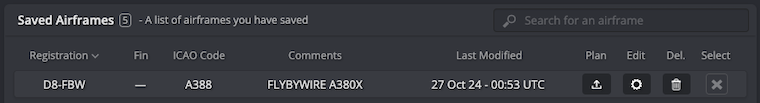
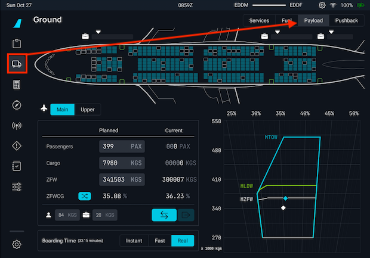
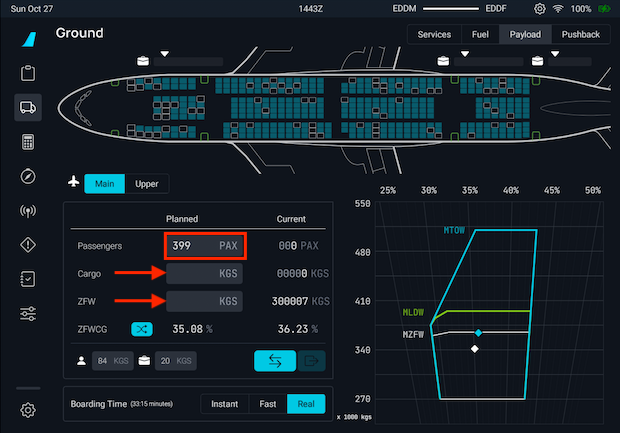
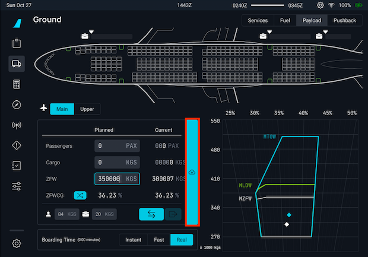
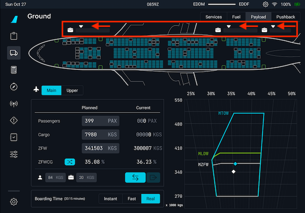
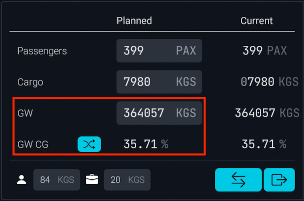
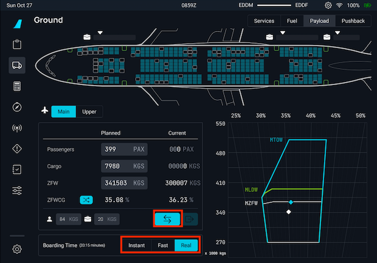
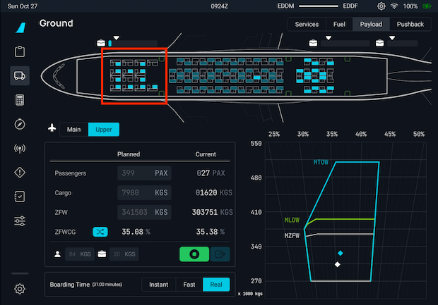

<link rel="stylesheet" href="/stylesheets/fuel-weight.css">

# Fuel and Weight

This section provides information on the A380X weight configuration and insight on how to utilize and reference onboard/sim features to configure the aircraft appropriately for departure.

---

??? info "General Fuel and Weight Information"
    ## General Fuel and Weight Information

    ### Operating Empty Weight
    
    It is important to understand that the term "operating empty weight" can seem a little generic. OEW is typically 
    calculated as "manufacturer's empty weight + standard items + operator items". These items can be the following (not 
    all-inclusive):
    
    - Crew members
    - Manuals
    - Food and Beverage
    - Emergency Equipment
    - and any equipment/supplies considered standard by the operator
    
    When considering your ZFW below, please keep into consideration the above information with OEW with particular regard that this weight does include the flight crew.
    
    ### Zero Fuel Weight
    
    In simple terms, the zero fuel weight (ZFW) = OEW + payload.
    
    Payload is defined as passengers, baggage, and cargo.
    
    In a situation where your payload would be approximately 40000 kg - *based on our new airframe:* your ZFW would total - 340007 kg (300007 kg + 40000 kg)
    
    You can reference this against any OFP you may have generated through SimBrief. For usage of our SimBrief integration - [read here](simbrief.md).
    
    ### Zero Fuel Weight Center of Gravity
    
    zero Fuel Weight Center of Gravity (ZFWCG) represents the aircraft's balance point without fuel, affecting stability and control during flight. This value must be set in the FMS before take off so the FMS can use it for optimal performance and balancing the aircraft.

    !!! warning "This is not your Center of Gravity for trimming."
    
    - See our [Weights and Balance](#loading-fuel-and-weight) section further down.
    - You can read about the FMS implementation in the [Beginner Guid FMS Preparation](../../../pilots-corner/a380x/a380x-beginner-guide/03_preparing-fms.md#fuel--payload).
    
    ### Center of Gravity
    
    An acceptable range for takeoff CG in the A380X is between 28-44%. The CG is balanced during the passenger loading process.

    Trimming the aircraft for takeoff is usually optional and technically not required. Please reference our the [FBW Checklist](../../../pilots-corner/a380x/a380x-sop.md) to set the appropriate trim should you wish to.
    
    !!! info "Notes on Differing CG Configurations"
    
    There are a few arguments worth considering when it comes to favoring an AFT CG or FWD CG. Generally, an AFT CG 
    would provide for better aircraft performance (lower stall speed, drag, and angle of attack for a given lift 
    coefficient) but generally worse for pitch stability.

    Most operators would favor an AFT CG loading for fuel consumption benefits when considering the lifetime of the fleet and how easy the benefits can be obtained.

??? info "Aircraft CG Envelopes"
    ## Aircraft CG Envelopes

    Our dynamic CG and payload chart provides the relevant visual information during the planning and execution of 
    passenger/cargo loading. Fully understanding how the longitudinal CG envelope affects the aircraft can be difficult. 
    Below is a great deep dive on understanding the chart and what the information provided indicates.

    <iframe src="https://www.sawe.ca/download/tech2011/Aircraft%20CG%20Envelopes.pdf" frameborder="0" marginwidth="0" marginheight="0" scrolling="no" style="border:1px solid #CCC;
    margin-bottom:5px;max-width: 100%; overflow: hidden; width: 100%; height: 600px;" allowfullscreen></iframe>`

---

## A380X Configuration

Make sure you have our latest [SimBrief Profile](simbrief.md#simbrief-airframe)

!!! danger "MSFS Fuel & Weights window in the toolbar"
    We have blocked the UI elements in the MSFS fuel and weights window. However, the sliders in the MSFS window are movable but in a matter of 1-3 seconds the fuel and payload levels should return to the initial value.

### Weights

- OEW (Empty Weight): 300007 kg (661403 lb)
    - Also referred to as DOW (Dry Operating Weight) which can be seen in other SimBrief OFP formats such as EZY
- MZFW (Max Zero Fuel Weight): 373000 kg (822324 lb)
- MTOW (Max Takeoff Weight): 510000 kg (1124400 lb)
- MLW (Max Landing Weight): 395000 kg (870826 lb)

!!! tip "FMS Gross Weight (FMS GW)"
    Gross weight is calculated as:

    !!! info ""
        Fuel Quantity (directly from the simulator's fuel system) + ZFW input in the MCDU.

    The GW will be visible on the lower ECAM and it will adjust based on the number of passengers, cargo and fuel on board. For an accurate reading, make sure boarding and fueling has completed.

### Fuel

!!! info ""
    The A380X, and the WV003 weight variant that we modeled, can hold up to 259471kg of fuel, but this would cause the MTOW to be exceeded. For this reason in the EFB we limit the use of the slider to a maximum of 220000 kg of fuel. You can still enter a larger value manually in the input box, if you would like to.

!!! info "Max Fuel Note"
    The actual maximum fuel load for any given flight will be less than the maximum fuel capacity. The fuel load at takeoff cannot be any greater than 510,000 kg (1,124,400 lb) minus the payload for the airplane's takeoff weight not to exceed the MTOW.

- Max Fuel Capacity: 209993 kg (462955 lb)
- Fuel tanks: 11
    - 2x Outer Tanks: 8301 kg (18301 lb) each
    - 2x Middle Tanks: 29272 kg (64534 lb) each
    - 2x Inner Tanks: 37045 kg (81669 lb) each
    - 4x Feed Tanks:
        - Feed 1 & 4 Tanks: 22184 kg (48907 lb) each
        - Feed 2 & 3 Tanks: 23562 kg (51946 lb) each
    - 1x Trim Tank: 19026 kg (41944 lb)

### Passengers

- Max Passenger Capacity: 50336 kg (484 seats * 104 kg) (110971 lb)
- Passenger Weight: 104 kg
    - 84 kg for passenger (including clothing and carry-on bags)
    - 20 kg for checked baggage
    - These default values can be overwritten by changing the used SimBrief airframe. See [Changing Default Weights Using SimBrief](#changing-default-weights-using-simbrief).
- Passenger compartments: 7
    - Main Deck:
        - PREMIUM ROWS 1-9: 56 seats, max 4704 kg (10371 lb)
        - ECONOMY ROWS 10-24: 132 seats, max 11088 kg (24435 lb)
        - ECONOMY ROWS 25-37: 124 seats, max 10416 kg (22963 lb)
        - ECONOMY ROWS 38-46: 82 seats, max 6888 kg (15185 lb)
    - Upper Deck:
        - FIRST ROWS 1-4: 14 seats, max 1176 kg (2593 lb)
        - BUSINESS ROWS 5-19: 58 seats, max 4872 kg (10741 lb)
        - BUSINESS ROWS 20-24: 18 seats, max 1512 kg (3334 lb)

### Cargo
- Max Cargo Capacity: 51400 kg (113317 lb)
- Cargo Compartments: 3
    - FWD CARGO HOLD: max 28576 kg (63000 lb)
    - AFT CARGO HOLD: max 20310 kg (44775 lb)
    - BULK CARGO: max 2514 kg (5542 lb)

## Changing Default Weights Using SimBrief

The A380X uses the following default weights for passengers and their baggage.

- 84 kg for passenger (including clothing and carry-on bags)
- 20 kg for checked baggage

The default weights can be changed in the EFB Payload page, as well as through changing the defaults of the SimBrief airframe.

To change the values in SimBrief, open your SimBrief airframe on the SimBrief website under "Saved Airframes" by clicking the Edit button.

{loading=lazy}

Scroll down to find the entries for Passenger Weight and Baggage Weight.

{loading=lazy}

Change the default weights as required, and make sure you select Save Aircraft at the bottom of the page. The A380X will use these new values the next time you import an operational flight plan based on this airframe.

!!! warning "Do Not Overload the Aircraft"
    It is the responsibility of the pilot to make sure the aircraft is not overloaded and within the specified limits.

    Especially important are:

    - MZFW (Max Zero Fuel Weight): 373000 kg (822324 lb)
    - Maximum payload (passengers, baggage, freight) is determined by the lowest of these calculations:
        - MZFW - OEW, or  373000 kg - 300007 kg = 72993 kg
        - MTOW - OEW - (fuel load - taxi out fuel), or 510000 kg - 300007 kg - (fuel load - taxi out fuel)
        - MLW - OEW - (all reserve/contingency fuel + extra fuel) , or 395000 kg - 300007 kg - (all reserve fuel/contingency/extra fuel).
    - When manually loading the payload, the MLW and MTOW limits are currently not checked and are the responsibility of the pilot.
    - SimBrief does manage payload limits by reducing the number of bags or passengers automatically. This is picked up by the aircraft correctly then.
    
    !!! danger ""
        If you manually specify a custom number of passengers that exceeds aircraft weight limitations, please be aware that the OFP will still reflect the user-selected number of passengers.

        This is in part because at the time when the OFP was generated, it interprets the passenger count as "booked passengers" and not current passengers on board the aircraft.

## Loading Fuel and Weight

!!! danger "MSFS Fuel & Weights window in the toolbar"
    We have blocked the UI elements in the MSFS fuel and weights window. However, the sliders in the MSFS window are movable but in a matter of 1-3 seconds the fuel and payload levels should return to the initial value.

### Loading Fuel

Fuel loading is exclusively done via our EFB, which has a great UI to see the status of fuel tanks and other options. [Guide Here](../../common/flypados3/ground.md#fuel-page).

### Weights and Balance

Get our [SimBrief Profile](../feature-guides/simbrief.md#simbrief-airframe).

!!! info "Please Note the Following"
    - The cargo hold field now depicts either metric tons or thousands of pounds, depending on the unit selected in the EFB Settings for aircraft configuration.
    - **Highly recommend** ensuring that you select the same weights (kg or lb) in the EFB and in SimBrief's OFP/Airframe before importing to prevent any mismatch in values.

!!! warning "Cold and Dark Startup"
    When starting the aircraft from a **Cold and Dark** state, please be aware of the following important information:

    - **FUEL&LOAD** must be completed before departure. (This is detailed in our [beginner guide](../../../pilots-corner/a380x/a380x-beginner-guide/03_preparing-fms.md#fuel--payload). 
    Please ensure that you complete this step when preparing the FMS).
    - Failure to complete the `FUEL&LOAD` page before starting an engine will display `INITIALIZE WEIGHT/CG` in amber on the FMS Messages.    
    - When there is a GW mismatch of more than 7 tonnes between the values calculated aerodynamically and the value calculated using the inputted ZFW and fuel flow `CHECK WEIGHT` will be displayed in amber on the FMS Messages.
    
    See [flyPadOS 3 - Development Version](../../common/flypados3/settings.md#aircraft-options--pin-programs) settings page if you wish to change the weight unit used by the aircraft systems.

#### Loading Guide

!!! warning "Fuel, Weights, and Balance When Not Starting Cold & Dark"
    The process described in this section is for starting the flight at a gate/ramp in a cold and dark state.

    If you start your flight on the runway or in the air, the loading process will only work if the Boarding Time [settings](../../common/flypados3/settings.md#sim-options) in the flyPad EFB are set to `Instant`. This is deliberate, as simulating the entire fueling or boarding process when starting from the runway does not make sense.

##### Finding the Payload Screen

The payload section can be found in the Ground Services Page on the EFB and selecting the Payload tab.



Once on this page, you will be presented with the following:

- A top-down model of the A380X seating configuration
- Entry fields to configure PAX and Cargo
- Per passenger weight and baggage weight entry
- Boarding time settings
- Dynamic CG and payload chart - [Learn More Above](#aircraft-cg-envelopes).

##### Passengers and Cargo Configuration

To begin boarding, you must first enter a value in the passenger entry field or the ZFW entry field. To achieve this, click on the respective entry field you wish to modify and input the value you plan or have been allocated via your OFP. This method is the simplest and will calculate appropriate values. The A380X seat configuration will also display in cyan seats that are filled.

You can switch between the Main and Upper deck by using the button. This way you can see which seats will be occupied on both decks based on the number of passengers set.

!!! tip "Passenger or ZFW Field"
    It is important to note that when first entering a value in the Passenger field, it will auto-calculate the ZFW. This is conversely true if you enter a value first into the ZFW field. Please utilize only a single field for your planning purposes.

This can be seen in the examples below:

!!! block ""
    {loading=lazy}
    {loading=lazy}

If you imported your SimBrief OFP from the main page on the EFB, the values in the Payload page will have been automatically filled in for you. If they haven't, or you made a change, you can use the button with the cloud icon to load them again from the OFP.

{loading=lazy}

!!! tip "Additional Features"
    ##### Additional Feature

    **Extra Cargo**

    After planning your cargo and passengers or using the SimBrief import function, you can add additional cargo by modifying the calculated cargo value. 

    !!! warning ""
        Please ensure you alter this value AFTER entering either your passenger or ZFW values.

    **Cargo Sliders**

    {loading=lazy}

    You can also interact with the sliders above the wireframe aircraft to fill the cargo bays. While this may be not as accurate, it does allow modification of the physical distribution of the cargo in the aircraft. The actual numerical weight of the cargo planned will update automatically.

    - Each slider represents one baggage compartment.
    - The white arrows in the image above indicate how much cargo to fill into each respective hold.

    ---

    **Custom Passenger Allocation**

    You can also interact with the A380X model to assign passenger seats and influence the layout of your passengers on board.

    ---

    **ZFW MAC %/CG and GW/GWCG**

    When utilizing the cyan switch button you can see the ZFW MAC %/CG and corresponding GW/GWCG reflect the correct 
    percentage based on the appropriate calculation. 

    !!! tip ""
        In the example below you can note that the fields for ZFW and ZFWCG have been swapped to GW and GWCG respectively.

    {loading=lazy}

    GW/GWCG is the Gross Weight and Gross Weight Center of Gravity and can be used to set the trim for takeoff. We plan to extend this feature at a later time to include TOCG.

    For more information, please see the [Center of Gravity](#center-of-gravity) section above.

##### Boarding Passengers

Once you are happy with the passenger count and weights calculated, you can start boarding by pressing the cyan "Boarding" button in the boarding time section. This field also allows you to customize how quickly passengers enter the aircraft.

{loading=lazy}

After boarding has started, the "Boarding" button will turn green, and you will start seeing passengers enter the aircraft, weight values changing in both the dynamic chart and the configuration section's current values.

The seats will also change colors from a dark to lighter cyan, indicating which seats passengers are currently occupying.

{loading=lazy}

---

## Fuel Persistence

After completing a flight, the A380X saves the amount of fuel on board to a special directory when at least one engine is off. This feature is tied to the aircraft registration found in `atc_id` in the `acft.cfg`.

If you decide to exit the simulator after your flight, loading back in at a later time with the same livery and associated registration will use the same amount of fuel from your previous flight.

These files are saved in our Work folder under `AircraftStates` alongside other files we store. The work folder can be found using this guide - [here](../../support/index.md).

!!! tip ""
    Reminder: This file is created/updated **ONLY** on the ground and with at least an engine off.

    If no registration is found, the default value is FBWA380X.

`AircraftStates/FBWA380X.ini` example:

```ini title="FBWA380X.ini"
[fuel]
fuel_center_quantity = 0.000000
fuel_left_quantity = 364.437298
fuel_right_quantity = 343.734621
fuel_left_aux_quantity = 228.000000
fuel_right_aux_quantity = 228.000000
```
