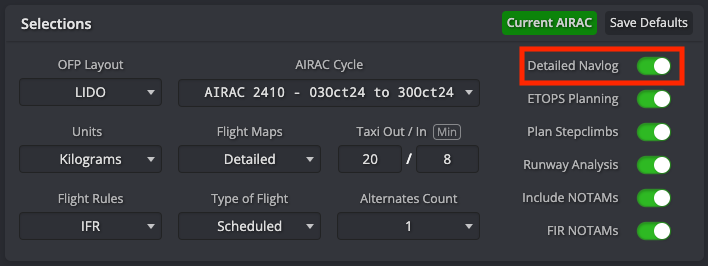
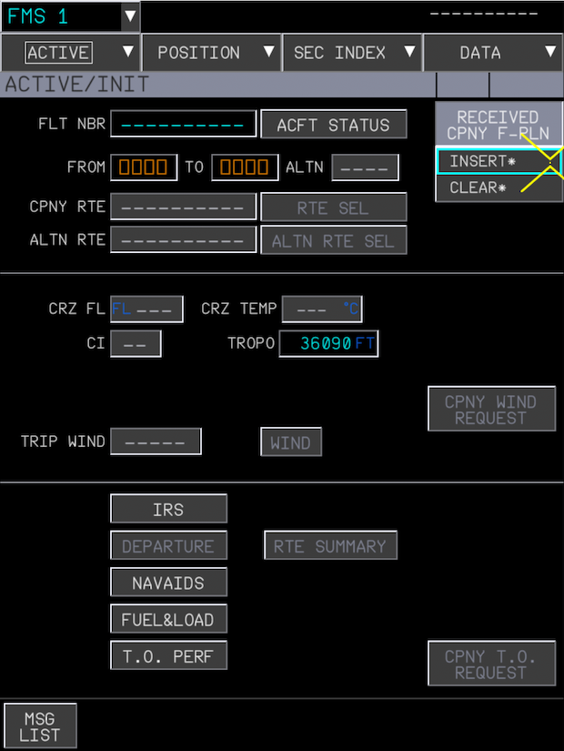

<link rel="stylesheet" href="../../../stylesheets/toc-tables.css">

# SimBrief and Navigraph Integration

Please use the Quick Links to jump to any relevant section. For connecting your SimBrief/Navigraph Accounts, click the button below.

[Setup SimBrief/Navigraph](#setup-a380x-simbrief-integration){.md-button}

## Quick Links

|                                    Quick Links                                    |
|:---------------------------------------------------------------------------------:|
|                        [Flight Planning](#flight-planning)                        |
|                      [SimBrief Airframe](#simbrief-airframe)                      |
|       [Setup A380X SimBrief Integration](#setup-a380x-simbrief-integration)       |
|    [Using flyPad SimBrief Integration](#using-the-flypad-simbrief-integration)    |
| [Using the FMS and SimBrief Integration](#using-the-fms-and-simbrief-integration) |

## Flight Planning

Check the [Flight Planning guide](flight-planning.md) for more details on Flight Planning in general.

In the world of flight simulation, SimBrief does all the flight planning for the users based on real word databases and
sources. SimBrief provides on average ~40,000 flight plans to users each day and is the most commonly used tool for
flight planning for non-professional flight simulation.

It is possible to use the SimBrief OFP (Operational Flight Plan) to configure and program the aircraft based on it
without any special integration into the flight sim software or aircraft.

### Flight Planning with SimBrief

This is best explained by SimBrief itself - [SimBrief User Guide](https://www.simbrief.com/system/guide.php){target=new}

---

## SimBrief Airframe

[SimBrief A380X Airframe](https://dispatch.simbrief.com/airframes/share/eyJiYXNldHlwZSI6IkEzODgiLCJpY2FvIjoiQTM4OCIsInJlZyI6IkQ4LUZCVyIsImZpbiI6IiIsInNlbGNhbCI6IktGQlciLCJoZXhjb2RlIjoiODk2NDY5IiwicGxhbmZvcm1hdCI6IiIsImZsaWdodHJ1bGVzIjoiIiwiZmxpZ2h0dHlwZSI6IiIsInBsYW51bml0cyI6IiIsImFsdG5zYWR2X3JhZGl1cyI6IjQ2MCIsImFsdG5zYWR2X3VuaXRzX3J3eSI6ImZ0IiwiYWx0bnNhZHZfcnd5IjoiNzAwMCIsIm5hbWUiOiJBMzgwLTg0MiIsImVuZ2luZXMiOiJUcmVudCA5NzJCLTg0IiwiY29tbWVudHMiOiJGTFlCWVdJUkUgQTM4MFgiLCJwZXIiOiJDIiwiY2F0IjoiSiIsImV0b3BzdGhyZXNob2xkIjoiNjAiLCJldG9wc3JhbmdlIjoiIiwiZXF1aXAiOiJTQURFMkUzRkdISUozSjRKNU0xUldYWVoiLCJ0cmFuc3BvbmRlciI6IkxCMUQxIiwicGJuIjoiQTFCMUMxRDFMMU8xUzIiLCJleHRyYXJtayI6IkZMWUJZV0lSRSBBMzgwWCIsIm1hbnVhbHJtayI6IiIsIndndHVuaXRzIjoiS0dTIiwibWF4cGF4IjoiNDg0IiwicGF4d2d0IjoiODQiLCJiYWd3Z3QiOiIyMCIsIm9ldyI6IjMwMDAwNyIsIm16ZnciOiIzNzMwMDAiLCJtdG93IjoiNTEwMDAwIiwibWx3IjoiMzk1MDAwIiwibWF4ZnVlbCI6IjI1OTc1NSIsIm1heGNhcmdvIjoiIiwiY2FyZ29tb2RlIjoiIiwiY29udHBjdCI6IiIsInJlc3ZydWxlIjoiIiwidGF4aWZ1ZWwiOiIiLCJtaW5mb2IiOiIiLCJtaW5mb2JfdW5pdHMiOiJ3Z3QiLCJtaW5mb2QiOiIiLCJtaW5mb2RfdW5pdHMiOiJ3Z3QiLCJtZWxmdWVsIjoiIiwibWVsZnVlbF91bml0cyI6IndndCIsImF0Y2Z1ZWwiOiIiLCJhdGNmdWVsX3VuaXRzIjoid2d0Iiwid3h4ZnVlbCI6IiIsInd4eGZ1ZWxfdW5pdHMiOiJ3Z3QiLCJhZGRlZGZ1ZWxfbGFiZWwiOiJleHRyYSIsImFkZGVkZnVlbCI6IiIsImFkZGVkZnVlbF91bml0cyI6IndndCIsInRhbmtlcmluZyI6IiIsInRhbmtlcmluZ191bml0cyI6IndndCIsImZ1ZWxmYWN0b3IiOiJQMDAiLCJjcnVpc2VvZmZzZXQiOiJQMDAwMCIsImNlaWxpbmciOiI0MzAwMCIsImRlZmF1bHRjcnVpc2UiOiJDSSIsImRlZmF1bHRjaSI6IiIsImRlZmF1bHRjbGltYiI6IjI1MC8zMjAvODQiLCJkZWZhdWx0ZGVzY2VudCI6Ijg1LzMwMC8yNTAiLCJ0aHJ1c3RfdW5pdHMiOiJsYmYiLCJ0aHJ1c3QiOiI3NTE1MiIsImZsYXRyYXRpbmciOiIifQ--){.md-button target=new}

Save/Copy this airframe into your fleet on SimBrief to use the A380X for flight planning.

## Setup A380X SimBrief Integration

!!! info "This integration does not require having an active Navigraph subscription."

Your Navigraph account needs to be configured in the flyPad EFB.

You can do this by navigating to the following page on the flyPad (EFB):

1. Settings Page
2. 3rd Party Options
3. Select the "Link Account" button next to Navigraph Account Link

{loading=lazy}

You will be presented with the following screen:

{loading=lazy}

Follow the instructions above to link your account.

If successful, you should see your account name followed by your Navigraph account subscription status (not required) and an option to Unlink Account. As seen below:

{loading=lazy}

!!! note "Overriding SimBrief User ID"
    There may be situations where you would like to import data from SimBrief not specifically linked to your account, i.e., copying a streamer's or friend's flight plan to your aircraft or using an add-on for shared cockpit scenarios.

    In this case you can override the SimBrief User ID by entering it in the SimBrief User ID field. This will override the linked Navigraph account temporarily until it is removed. You will be notified when the override is successful with a pop up message. Example below:

    {loading=lazy}

If you are still unsure of where the Settings page on the EFB is, please see [flyPad Settings](../../common/flypados3/settings.md).

## Using the flyPad SimBrief Integration

### Importing the SimBrief OFP to the flyPad

See [flyPad Guide - Load from SimBrief](../../common/flypados3/dashboard.md#load-from-simbrief)

See [flyPad Guide - OFP](../../common/flypados3/dispatch.md#ofp-page) on how to view the SimBrief Operational Flight Plan.

See [Fuel and Weight](loading-fuel-weight.md) on how to load fuel and payload.

---

## Using the FMS and SimBrief Integration

### Importing the SimBrief OFP to the FMS

We've included a quick method to have your SimBrief OFP automatically loaded into the FMS.

!!! warning "Please do not select an arrival airport on the MSFS world menu, otherwise the integration will not work."

This portion of the guide assumes that you understand how to generate a SimBrief OFP.
Otherwise, read the [SimBrief User Guide](https://www.simbrief.com/system/guide.php){target=new} first.

!!! warning "Please Enable Detailed Navlog SimBrief Setting"
    {loading=lazy}

    It is important when generating your SimBrief OFP to ensure that the Detailed Navlog setting is enabled. 

    This setting is available when generating a new dispatch. Additionally, we recommend that you save any of your preferred settings here, including Detailed Navlog as the default by clicking on `Save Default`. This ensures that this setting is never disabled when generating a new OFP.

    If the setting is not enabled, the import function may only populate the departure and arrival airports into the flight page on the FMS.

#### Request Data from SimBrief and Initialize Flight Plan

To start the process of importing data from SimBrief, open the `INIT` page and click on `CPNY F-PLN REQUEST`.

This will show a message `UPLINK INSERT IN PROG`, indicating that the FMS is loading the OFP. Once it is done, the `CPNY F-PLN REQUEST` button will change to `RECEIVED CPNY F-PLN`. Clicking the button will give you the option to `INSERT` or `CLEAR` the loaded information.

Click `INSERT` and all information in the `INIT` page will be automatically filled in. Additionally, the flight plan will be loaded from SimBrief directly into the FMS.

{loading=lazy}

!!! note
    #### RWY, SID, STAR, and APPR
    The SimBrief import will **not** load RWY, SID, STAR, or APPR. You will need to manually add these into the flight plan. To learn how to set up the FMS, you can read the [**^^F^^**LIGHT PLAN](../../../pilots-corner/a380x/a380x-beginner-guide/03_preparing-fms.md#init--flight-plan-initialization) section in our beginner's guide.

    This is because RWY, SID, STAR and APPR are dependent on factors like active runways, traffic, weather, etc. and are determined by ATC and not the pilot's flight plan. They can be changed by ATC any time before takeoff or during flight and are therefore not imported in real life aircraft either.  

### Wind Request

!!! warning "Important Notes"
    Currently, the wind request system is not implemented yet for the A380X. This will be introduced in a future update.

### Fuel and Weight

See [Fuel and Weight](loading-fuel-weight.md)
