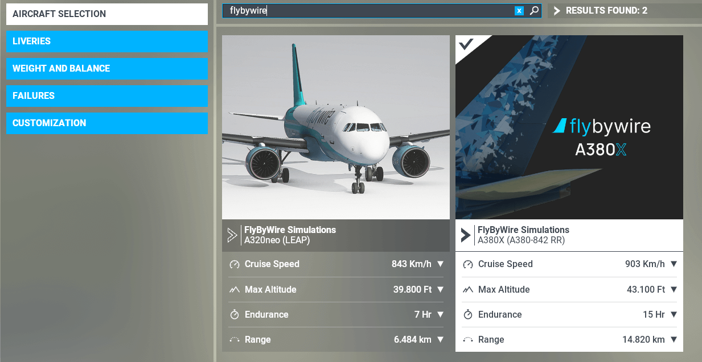

- **A32NX FAQ**

    ---

    Get quick answers to common questions [here](a32nx/index.md#a32nx-quick-faq).

- **A380X FAQ**

    ---

    Get quick answers to common questions [here](a380x/index.md#a380x-quick-faq).

## General

???+ info "Q: Where are our planes in-sim?"
    Both of our aircraft are searchable in the aircraft selection menu. 

    

    - The A32NX is listed as `FlyByWire Simulations A320neo (LEAP)`

    - The A380X is listed as `FlyByWire Simulations A380X (A380-842R RR)`

    !!! tip "A32NX"
        The A32NX is a separate aircraft from the default Asobo A320. 

        Please esnure you have selected aircraft `FlyByWire Simulations A320neo (LEAP)` instead of the Asobo variant in the 'aircraft selection' menu before loading the flight.

??? info "Q: Can I download the aircraft's in the current state?"
    Yes, see [Downloads](install/installation.md#downloads).

??? info "Q: How do I install your aircraft's?"
    Visit our [Installation Guide](install/installation.md).

??? info "Q: What liveries are available?"
    We recommend downloading compatible liveries from [Flightsim.to](https://flightsim.to/c/liveries/flybywire-a32nx/){target=new}.

    **NOTE:** Liveries for the default A320neo are incompatible with the A32NX. 

??? info "Q: Do we have a simBrief profile for our aircraft?"
    Yes, there is one available for all versions of our aircraft. 

    A32NX: [A32NX SimBrief Integration](./a32nx/feature-guides/simbrief.md#simbrief-airframe)

    A380X: [A380X SimBrief Integration](./a380x/feature-guides/simbrief.md#simbrief-airframe)

??? info "Q: When will it be released?"
    The project is an ongoing rolling release. See [Downloads](install/installation.md#downloads).

??? info "Q: When is the next update?"
    We don't know when the next update will be, however you can keep track of development via commit logs and Stable release logs.

    [Version Information](install/fbw-versions.md){.md-button}

??? info "Q: How do I join the team?"
    Head over to the [Development Corner](../dev-corner/dev-guide/index.md) and join our Discord to get started.

??? info "Q: Is it payware?"
    No, it is a completely free and open-source aircraft.

??? info "Q: How do we report bugs?"
    Report bugs to us in the [Discord server](https://discord.gg/flybywire){target=new}, under the [#a32nx-support](https://discord.com/channels/738864299392630914/785976111875751956) or [#a380x-support](https://discord.com/channels/738864299392630914/1296889278332145714) channel. 

    Additionlly you can create a [GitHub issue](https://github.com/flybywiresim/aircraft/issues/new/choose){target=new}.

    Just make sure to search for existing issues first before creating a new one.

??? info "Q: Why is my version not the same as what I see others using?"
    We have different versions of available for both the A32NX and A380X. For more information please visit the page below.

    [Version Information](install/fbw-versions.md){.md-button}

??? info "Q: Do your aircraft have WXR (weather radar) capabilities?"

    Due to simulator limitations it isn't possible to display an accurate weather radar data on the ND at this time.

