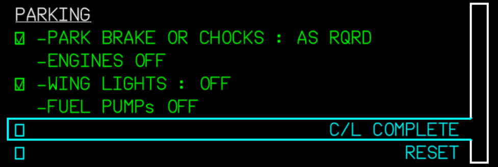
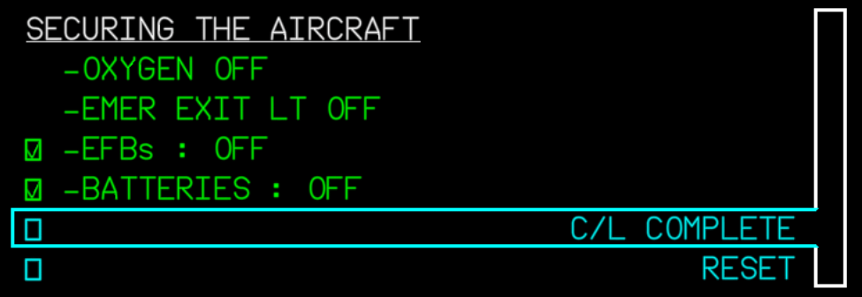

<link rel="stylesheet" href="/stylesheets/bg.css">

# Powering Down

This guide will explain the correct procedures to power down the aircraft when at the gate after arriving at the
destination and taxiing to the designated gate.

!!! warning "Disclaimer"
    
This is for simulation purposes only.

    The level of detail in this guide is meant to help a Airbus A380 beginner correctly shut down the aircraft.

    A *beginner* is defined as someone familiar with flying a GA aircraft or different types of airliners. Aviation 
    terminology and know-how is a requirement to fly any airliner, even in Microsoft Flight Simulator.

---

## Prerequisites

- Aircraft is at the gate after landing and taxi as per previous chapters.

[Download FlyByWire Checklist](../assets/sop/FBW_A380X_Checklist.pdf){ .md-button }

## Chapters / Phases

This guide will cover these phases:

1. [Parking at the Gate](#1-parking-at-the-gate)
2. [Disembarking Passengers and Baggage](#2-disembarking-passengers-and-baggage)
3. [Securing the Aircraft](#3-securing-the-aircraft)

---

## Preface

Shutting down and securing an aircraft is an important part of the overall procedure. Obviously, less important in a
simulator, as the next flight will have the aircraft start in a cold and dark state again.

If we want to actually do a turn around and start a new flight directly, the procedure will be a little different, as we
would not turn off certain systems and at some point simply start with the preparation of the aircraft procedure again.

## 1. Parking at the Gate

**Situation**

- We arrived at the designated gate after taxiing from the runway where we landed.
- Aircraft is in taxi state as per previous chapters.
- Engines are still running.
- Lights might still be in taxi configuration (`RWY TURN OFF` set to on and `NOSE` is to taxi, `LAND`-ing lights are off).
- `APU` has been turned on during taxi and is `AVAIL`, `APU BLEED` is off.
- **After Landing** checklist is completed.

### Gate procedures

??? tip "What and Why?"
    We have arrived at our gate, and we are ready to disembark our passengers and cargo, and get the plane ready for the
    next crew. To do this, we will take a couple of steps to ensure the aircraft is parked safely, secured, and still has
    power and air conditioning when we go to shut the engines off. We also need to shut off our exterior lighting that is no
    longer necessary.

`ANTI-ICE ............................................................. OFF` 
`APU BLEED ............................................................. ON` 
`PARKING BRAKE ......................................................... ON` 
`ENGINE MASTER SWITCHES (1, 2, 3, 4) .................................. OFF` 
`SEAT BELTS ........................................................... OFF` 
`SLIDES DISARMED .................................................... CHECK` 
`ENGINE ALL N1 < 5% ..................................................AWAIT` 
`BEACON ............................................................... OFF` 
`EXTERIOR LIGHTS ...............................................AS REQUIRED` 
`GROUND CONTACT ............................................... ESTABLISHED` 
`FUEL PUMPS ........................................................... OFF` 
`FUEL QUANTITY .................................................... CHECKED` 
??? note "Fuel Quantity"
    Verify the amount of fuel left on board is consistent with the predicted fuel remaining.

??? tip "How and Where?"
    [Flight Deck Overview](../../a380x-briefing/flight-deck){ .md-button }

    Use the Flight Deck Overview to locate the items mentioned above. The Flight Deck Overview is a
    clickable cockpit that will show you where each item is located.
    
    * [Anti-Ice](../../a380x-briefing/flight-deck/ovhd/anti-ice)
    * [APU Bleed](../../a380x-briefing/flight-deck/ovhd/apu)
    * [Parking Brake](../../a380x-briefing/flight-deck/pedestal/parking-brake)
    * [Engine Master Switches](../../a380x-briefing/flight-deck/pedestal/engine-master)
    * [Seat Belts](../../a380x-briefing/flight-deck/ovhd/int-lt)
    * [Beacon](../../a380x-briefing/flight-deck/ovhd/ext-lt)
    * [Exterior Lights](../../a380x-briefing/flight-deck/ovhd/ext-lt)
    * [Fuel Pumps](../../a380x-briefing/flight-deck/ovhd/fuel)

`PARKING CHECKLIST ............................................... COMPLETE` 
??? note "Parking Checklist"
    The Airbus A380 has a built-in checklist system that can be accessed via the
    [Engine Warning Display (EWD)](../../a380x-briefing/flight-deck/main-panel/ewd).

    To activate it you need to press the `C/L` button on the 
    [ECAM Control Panel (ECP)](../../a380x-briefing/flight-deck/pedestal/ecam-cp).

    You can navigate through the checklist by using the `UP` and `DOWN` buttons on the ECP. You can check/uncheck items
    by pressing the buttons with the check mark on the ECP.

    Some items are autosensed by the aircraft and will be checked automatically.

    {loading=lazy} 

This concludes *Parking at the Gate*.

## 2. Disembarking Passengers and Baggage

**Situation**

- **Parking** checklist is completed.

In real life, there are many things that begin automatically after parking at the gate. The Jetway is connected to the
aircraft, doors are opened, passengers disembark, cargo is unloaded, etc. The pilots don't have to do much to trigger
these steps.

In the simulator, though, we would have to trigger these events by ourselves. For this, we use the FlyByWire flyPad's
ground functionality or the Microsoft Flight Simulator's built-in ATC to start these procedures. There are also some
nice add-on tools out there which help with this.

Taking care of passengers and luggage with the FlyByWire flyPad:

- Go to the flyPad (view can be activated by `Ctrl+0`).
- Connect the Jetway (PAX).
- Call cargo/baggage (Baggage).

This would take a while in real life, and we would not be able to shut down the aircraft before all
passengers and crew have disembarked.

For a turnaround, we would start preparing the aircraft for the next flight, and the cabin crew would coordinate
everything from disembarking the passengers to cleaning and resetting the cabin.

After refueling, the pilot would signal to the cabin crew that they could let the new passengers board the aircraft once
the cabin is ready.

This concludes *Disembarking Passengers and Baggage*.

## 3. Securing the Aircraft

**Situation**

- **Parking** checklist is completed.
- Aircraft is empty (no passengers or cargo).
- Cabin is cleaned and ready for shutdown.

??? tip "What and Why?"
    In the event that there is no other crew that will use this aircraft for a flight immediately following ours, we are
    going to secure the aircraft. Doing this will put the aircraft into a `Cold and Dark` state, meaning whoever flies the
    aircraft next will have to do a complete power up. To do this, we will need to shut off all lighting, power and fuel
    pumps. We are essentially doing the opposite of what we did when we powered the plane up from a `Cold and Dark` state.

`PARKING BRAKE ......................................................... ON` 
`OXYGEN CREW SUPPLY ................................................... OFF` 
`ADIRS (1+2+3) ........................................................ OFF` 
`EXTERIOR LIGHTS ...................................................... OFF` 
`APU BLEED ............................................................ OFF` 
`EXTERNAL POWER ....................................................... OFF` 
`AUXILIARY POWER UNIT MASTER SWITCH ................................... OFF` 
`EMERGENCY EXIT LIGHTS ................................................ OFF` 
`NO SMOKING ........................................................... OFF` 

??? tip "How and Where?"
    [Flight Deck Overview](../../a380x-briefing/flight-deck){ .md-button }

    Use the Flight Deck Overview to locate the items mentioned above. The Flight Deck Overview is a
    clickable cockpit that will show you where each item is located.
    
    * [Parking Brake](../../a380x-briefing/flight-deck/pedestal/parking-brake)
    * [Oxygen Crew Supply](../../a380x-briefing/flight-deck/ovhd/oxygen)
    * [ADIRS](../../a380x-briefing/flight-deck/ovhd/adirs)
    * [Exterior Lights](../../a380x-briefing/flight-deck/ovhd/ext-lt)
    * [APU Bleed](../../a380x-briefing/flight-deck/ovhd/apu)
    * [External Power](../../a380x-briefing/flight-deck/ovhd/elec)
    * [APU Master Switch](../../a380x-briefing/flight-deck/ovhd/apu)
    * [Emergency Exit Lights](../../a380x-briefing/flight-deck/ovhd/signs)

`SECURING THE AIRCRAFT CHECKLIST ................................. COMPLETE` 
??? note "Securing the Aircraft Checklist"
    The Airbus A380 has a built-in checklist system that can be accessed via the
    [Engine Warning Display (EWD)](../../a380x-briefing/flight-deck/main-panel/ewd).

    To activate it you need to press the `C/L` button on the 
    [ECAM Control Panel (ECP)](../../a380x-briefing/flight-deck/pedestal/ecam-cp).

    You can navigate through the checklist by using the `UP` and `DOWN` buttons on the ECP. You can check/uncheck items
    by pressing the buttons with the check mark on the ECP.

    Some items are autosensed by the aircraft and will be checked automatically.

    {loading=lazy}

`ALL BATT (Battery 1, Essential, Battery 2, APU Battery) .............. OFF` 

Now the aircraft is back in a cold and dark state.

This concludes *Securing the Aircraft*

