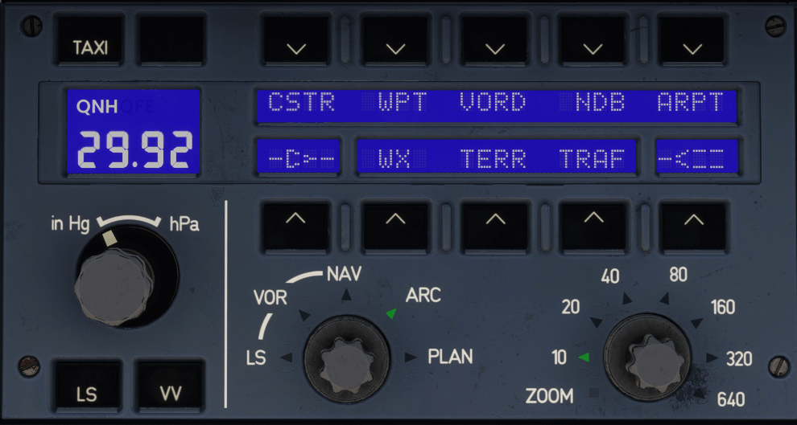

# Electronic Flight Instrument System (EFIS) Panel

---

[Back to Main Instrument Panel and Glareshield](../overviews/main-glare.md){ .md-button }

---

## Description

The Electronic Flight Instrument System (EFIS) lets you control what flight info shows up on the Primary Flight Displays
(PFDs) and the Navigation Displays (NDs).

The EFIS Control Panel helps the flight crew pick and set up the info they want to see on the PFDs and NDs.

## Usage

### TAXI pb

Press this to turn the ETACS (Enhanced Taxi Aid and Crew Awareness System) video on or off on the PFD.

!!! warning "ETACS"
    The ETACS system isn't simulated in the A380X because of simulator limitations.

### ND Data Display pushbuttons

These buttons let the flight crew choose what info to show on the NDs.

| Button  | Function                                                                                        |
|---------|-------------------------------------------------------------------------------------------------|
| CSTR pb | Toggles showing flight plan constraints on the ND.                                              |
| WPT pb  | Toggles showing waypoints on the ND.                                                            |
| VORD pb | Toggles showing VOR/DME stations on the ND.                                                     |
| NDB pb  | Toggles showing NDB stations on the ND.                                                         |
| ARPT pb | Toggles showing airports on the ND.                                                             |
| VOR1 pb | Toggles showing the selected VOR1 information on the ND.                                        |
| WX pb   | Toggles showing weather radar information on the ND. (INOP) |
| TERR pb | Toggles showing terrain information on the ND.                                                  |
| TRAF pb | Toggles showing traffic information on the ND.                                                  |
| VOR2 pb | Toggles showing the selected VOR2 information on the ND.                                        |

### Barometric Reference Window

- If `QNH` is in the upper left corner:
    - The barometric reference is set to the number shown.
    - The QNH range is from 745 hPa (22.00 inHg) to 1 100 hPa (32.48 inHg).
- If `QNH` isn't in the upper left corner and `STD` is shown:
    - The barometric reference is STD.
    - Turning the inner knob presets a QNH (upper right corner) and sets it when the knob is pushed.

### Barometric Reference Controls
The barometric reference controls have an outer selector and an inner knob.

The flight crew uses the selector to pick the barometric unit (hectoPascal or mercury inches) for the values shown in 
the barometric reference window.

Note: The PFDs don't show the selected barometric unit.

The flight crew uses the knob to set the barometric reference value. When the EFIS CP powers up, the barometric 
reference value starts at 1 013 hPa or 29.92 inHg, depending on the selected unit.

When the flight crew:

- **pushes** the knob, the barometric reference is set to STD. 
  They can turn the knob to preset a QNH value. When they switch back to the QNH barometric reference, it automatically 
  shows this preset value.
- **pulls** the knob, the barometric reference is set to QNH, and the preset value is selected. 
  Note: The selected value appears in the barometric reference window and under the altitude scale on the PFD.

### LS pb

The Captain's (First Officer's) PFD shows landing system data based on the approach selected on the FMS ARRIVAL page: 
Deviation scales, deviation signals, course pointer, and info.

Note:

1. If the destination airport is more than 300 NM away, only the deviation scales appear.
2. The LS light automatically comes on when LOC, LOC B/C, or F-LOC arms.

The Captain's (First Officer's) PFD doesn't show the landing system data.

### VV pb

Press this to show or hide the Velocity Vector (VV) on the PFD.

### ND Mode Selector

This selector lets the flight crew pick the ND mode they want.

The flight crew can choose from these modes:

- PLAN mode:
    - Shows the flight plan on a map with North/South and West/East references.
    - Lets the flight crew scroll through and display the entire flight plan.
- ARC mode:
    - Shows a 100° sector in front of the aircraft.
- ROSE-NAV mode:
    - Shows the same info as ARC mode but in a 360° sector.
    - Displays the ROSE-NAV in relation to the aircraft heading.
    - Defaults to ROSE-NAV mode with an 80 NM range if the ND mode or range isn't valid.
- ROSE-VOR mode:
    - Shows the aircraft's position relative to the tuned VOR.
    - Displays the ROSE-VOR in relation to the aircraft heading.
- ROSE-LS mode:
    - Shows the aircraft's position relative to the LOC, F-LOC, G/S, and F-G/S indications.
    - Displays the ROSE-LS in relation to the aircraft heading.

### ND Range Selector

The flight crew sets the range for the ND (Navigation Display) and the VD (Vertical Display) in nautical miles.

When set to ZOOM, the ND shows the moving airport map.

Note: The VD range is limited to 160 NM.

If set to ZOOM, the VD display isn't available.

If the flight crew changes ND mode from ARC to one of the ROSE or PLAN modes, the ND range automatically increases to 
the next value to keep the same distance in front of the aircraft mock-up.

If the flight crew changes ND mode to ARC mode, the ND range automatically decreases to the previous value.

---

[Back to Main Instrument Panel and Glareshield](../overviews/main-glare.md){ .md-button }

---

