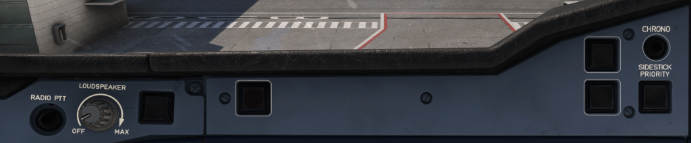

# Glareshield Side Panels

---

[Back to Main Instrument Panel and Glareshield](../overviews/main-glare.md){ .md-button }

---

## Usage

### CHRONO pb

- When pressed one time, the ND displays and starts the chronometer.
- When pressed two times, the ND freezes the time that appears on the ND.
- When pressed three times, the ND resets the chronometer, and the ND no longer displays the time.

### SIDESTICK PRIORITY pb

- Red arrow light:
    - Illuminates in front of the pilot who is losing authority.
    - Light extinguishes if the pilot has recovered authority.
        - If the pilot either:
            - Releases his TAKEOVER pb before the priority condition is set
            - Used the TAKEOVER pb to cancel a set priority situation. 
              **Sidestick priority audio**: The audio voice message "PRIORITY LEFT" or "PRIORITY RIGHT" is played each 
              time priority is taken.

- Green CAPT and F/O lights:
    - Both lights will flash if the pilots are attempting to move both sidesticks at the same time and neither pilot 
      takes priority.
    - If a pilot who has taken priority by using the TAKEOVER pb and the other pilot's sidestick is in motion or not 
      neutral, the light of the pilot who has taken priority illuminates. It will extinguish when the opposing sidestick 
      returns to the neutral position.

### Attention Getters

There are two attention-getters on the glareshield of each flight crew member\`s station:

One MASTER WARN light, and one MASTER CAUT light,
depending on the severity of the failure. These attention-getters inform the flight crew of an alert.

When pressed, the lights go off and the associated aural warnings stop.

MASTER WARN flashes in the case of emergency situations (e.g. emergency procedure
displayed on the EWD).

MASTER CAUT lights up in the case of abnormal situations (e.g. abnormal procedure
displayed on the EWD).

Note: In the case of multiple failures, both MASTER WARN lights and
MASTER CAUT lights may come on at the same time.

### AUTOLAND WARNING LIGHT

The events below trigger a flashing AUTOLAND red warning accompanied by a triple click audio warning when the aircraft
is below 200 ft RA and the aircraft is in LAND mode:

- AP1 and AP2 OFF below 200 ft RA.
- LOC deviation (1/4 dot above 15 ft RA) or GLIDE deviation (1 dot above 100 ft RA). Both LOC and GLIDE scales will 
  flash on the PFD.
- LOC signal lost above 15 ft or loss of GLIDE signal when above 100 ft. The flight director bars flash on the PFD and 
  LAND mode remains engaged.
- Difference of radio altimeter indications is more than 15 ft.

### ATC MSG

If flashing: A message from the ATC has been received.

Associated with a RING aural alert that sounds:

- 10 s after the reception of a normal message
- Immediately after the reception of an urgent message. 
  When the flight crew presses one of the two pushbuttons, the ATC MSG lights go off and the aural alert is canceled. 
  The RING aural alert also stops if the flight crew reads the message.

The ATC MSG pb lighting and the aural alert are inhibited during takeoff and landing.

### LOUDSPEAKER

Volume control for the loudspeaker.

### RADIO PTT

Push-to-talk button for the radio.

---

[Back to Main Instrument Panel and Glareshield](../overviews/main-glare.md){ .md-button }

---
