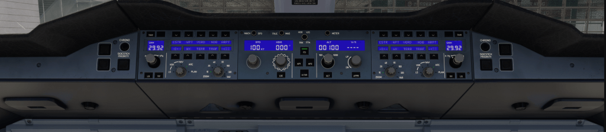

# Glareshield Underside

---

[Back to Main Instrument Panel and Glareshield](../overviews/main-glare.md){ .md-button }

---

## Description

The Glareshield Underside has 4 knobs to control the brightness of the instrument panel flodd lights and the 
brightness of the glareshield integral lights and LCD brightness.

## Usage

From left to right:

- Brightness for the instrument panel flood lights on the Captain side.
- Brightness for the glareshield integral lights.
- Brightness for the LCD displays.
- Brightness for the instrument panel flood lights on the First Officer side.

---

[Back to Main Instrument Panel and Glareshield](../overviews/main-glare.md){ .md-button }

---

