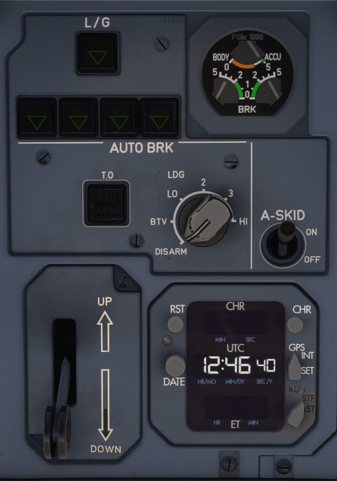

# Center Right Panel

---

[Back to Main Instrument Panel and Glareshield](../overviews/main-glare.md){ .md-button }

---

{loading=lazy width=50%}

## Description

We have consolidated the Center Right Panel into a single page. The Center Right Panel is holding the following 
controls and instruments:

- Landing Gear Indicator
- Brake Accumulator Pressure Gauge
- Autobrake Selector
- RTO (Rejected Takeoff) Button
- Anti Skid Switch
- Gear Lever
- Clock

## Usage

### Landing Gear Indicator

The landing gear indicator is located on the center right panel. It displays the status of the nose landing gear (NLG),
the left wing landing gear (WLG), and the body landing gear (BLG).

The NLG, the WLG and the BLG indicator lights have the same logic.

- Unlit: 
    - The associated landing gear is uplocked and the landing gear lever is in the UP position.
- Green:
    - The associated landing gear is downlocked and the landing gear lever is in the DOWN position.
- Red UNLK
    - The associated landing gear is:
        - In transit, or
        - Not locked in the selected position, after the normal extension/retraction delay.
          In this case, the L/G GEAR NOT LOCKED DOWN or L/G GEAR NOT LOCKED UP alerts are displayed.

### Body Accumulator Pressure Gauge

The BODY ACCU pressure indication shows the lowest BLG brake accumulator pressure.

- GREEN ARC: 
    - The green arc represents the normal pressure zone.
    - The green arc ranges from 4872 to 5000 PSI.
- AMBER ARC:
    - The amber arc represents the low pressure zone.
    - The amber arc ranges from 0 to 3840 PSI.

When the indication is in the amber arc, the flight crew should press the ACCUS REINFLATE pb to
reinflate the BLG brake accumulators before towing/push-back and before engine start.

### Autobrake Selector

The flight crew arms/disarms a landing AUTO BRK mode, by rotating the AUTO BRK mode selector to the appropriate position.

Each mode corresponds to a deceleration target.

If all the AUTO BRK arming conditions are satisfied, the selector is electrically maintained in the selected position.

If an arming condition is lost or the RTO mode is armed, the selector automatically returns to the DISARM position. For 
BTV, in the case of a reversion to BRK HI, the selector stays on BTV position even if the FMA displays BRK HI. 
Simultaneously, the light of the RTO pb or ACTIV light go off.

Note: A landing AUTO BRK mode can be armed in flight, and on ground.

### RTO (Rejected Takeoff) Button

When the RTO pb is pressed, the RTO mode arms and the RTO ARM light goes on provided all the arming conditions are 
satisfied. In addition, RTO in blue is displayed on PFD FMA left column.

When the RTO pb is pressed again, the RTO mode disarms.

Note: The RTO mode can be armed only on ground.

### Anti Skid Switch

- ON: 
    - The A-SKID is available if normal braking or alternate braking with A-SKID are available.
- OFF:
    - The A-SKID is off. As a consequence, emergency braking is active.
    - A-SKID sw OFF is to be used only in case of total brake efficiency loss.
    - Note: A-SKID sw OFF does not cut off NWS

### Gear Lever

In UP position, the landing gear retraction is selected. 

In DOWN position, the landing gear extension is selected.

The red arrow goes on and flash when the aircraft is in a landing configuration below 750 ft radio altimeter and one or 
more landing gears are not downlocked. 

The red arrow logic is independent from the position of the landing gear lever.

The L/G GEAR NOT DOWN alert displays simultaneously.

### Clock

The A380X has a built-in independent clock which sends time data to several systems. It has redundant electrical 
supply and is also directly connected to the aircraft's Hot Battery Bus.

Functions:

- "UTC" (GMT) time in hours, minutes, and seconds on the center counter.
- Elapsed time (ET) (from engine startup) in hours and minutes on the lower counter.
- Chronometer (CHR), which measures a time interval (from the pushing of the CHRONO button) in minutes and seconds.
- Date display.

#### UTC (GMT) counter

24-hour format clock.

#### Elapsed Time (ET) counter

Tracks flight time

#### Chrono (CHR) counter

Tracks elapsed time. Controlled by the CHR pushbutton.

The first push starts the CHR counter and the second push stops the CHR counter but keeps the display at its last indication.

#### Reset (RST)

Resets the chrono counter when the counter is running.

#### ET selector

- RUN:
    - ET counter starts
- STP:
    - ET counter stops
- RST:
    - ET counter is blanked. The selector returns to its STP position when the selector is released.

Note: When alternating between "RUN" and "STP" a cumulative elapsed time can be measured.

#### DATE/SET button

- Not pushed:
    - Time mode. The date display disappears.
- Pushed:
    - Date mode. The UTC time display is replaced by the date (day month year).

#### Operating Mode Selector

The operating mode selector has three positions.
Two of these positions correspond to operating modes

GPS mode: The time and date synchronize with the GPS.
INT mode: The clock internally computes the time and date. 
SET: The flight crew manually sets the time and date.

!!! warning ""
    The operating mode selector is currently not functional in the A380X.

---

[Back to Main Instrument Panel and Glareshield](../overviews/main-glare.md){ .md-button }

---

