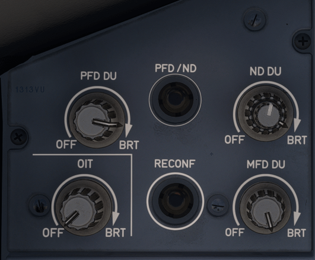

# Display Unit Control Panel

---

[Back to Main Instrument Panel and Glareshield](../overviews/main-glare.md){ .md-button }

---

{loading=lazy width=50%}

## Description

The Display Unit Control Panel (DU CP) is located on the main instrument panel on each side for the Captain and the 
First Officer. The DU CP is used to configure the displays for the Primary Flight Display (PFD), the Navigation Display 
(ND), the Onboard Information Terminal (OIT), and the Multi-Function Display (MFD).

## Usage

### PFD DU KNOB
When turned, turns on or off the PFD screen, and adjusts the brightness of
the PFD display unit.

### ND DU KNOB

- Inner knob: 
    - Turns on or off the ND
    - Adjusts the brightness of the ND.
- Outer knob:
    - controls the brightness of both the weather radar image and the terrain display.

### PFD/ND pb

When pressed, exchanges the onside PFD and the ND, regardless of their default position.

!!! warning ""
    The PFD/ND pb is not functional in the A380X.

### OIT knob

When turned, turns on or off the OIT screen, and adjusts the brightness of the OIT display unit.

!!! warning ""
    The OIT knob is not functional in the A380X.

### RECONF pb

!!! warning ""
    The RECONF pb is not functional in the A380X.

In case of a display unit failure, the flight crew can manually reconfigure one of the remaining display units to 
recover the lost display.

This manual reconfiguration is done using:

- either the reconfiguration pushbutton (DU RECONF pb)
- or, the KCCU function keys.

This DU RECONF pb is active only if there is a failed on-side display unit. The EWD DU and SD DU can be reconfigured 
from both sides.

The push-button acts on the following display unit, in the given order.

For the CPT side:

1. The MFD DU
2. The ND DU, if the MFD DU is failed
3. The PFD DU, if both the ND DU and MFD DU are failed.

For the F/O side:

1. The ND DU, if the PFD DU and ND DU are both operative
2. The MFD DU, if either the PFD DU or the ND DU is failed 
   Note: This is to favor the display of the PFD on either the PFD or ND DU.
3. The PFD DU, if both the ND DU and MFD DU are failed. 

Note:

- If the EWD DU, and/or SD DU fails, the EWD and/or the SD can be displayed on either side
- The EWD (SD) cannot be displayed on both sides at the same time

### MFD knob

When turned, turns on or off the MFD screen, and adjusts the brightness of the MFD display unit.

---

[Back to Main Instrument Panel and Glareshield](../overviews/main-glare.md){ .md-button }

---
