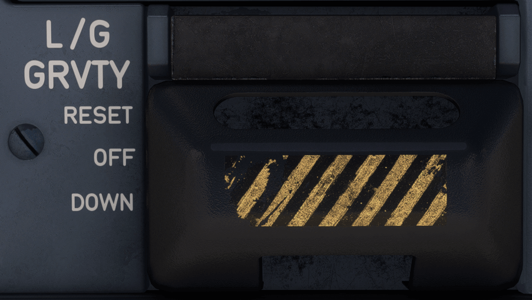

# Gravity Gear Panel

---

[Back to Main Instrument Panel and Glareshield](../overviews/main-glare.md){ .md-button }

---

{loading=lazy width=50%}

## Description

## Usage

### L/G GRVTY sw

The L/G GRVTY panel has two switches that are linked together for simultaneous operation, and protected by a cover. 
However, if the link is removed, the switches can be used separately, for maintenance purposes only.
Each switch controls one FFCM.

- OFF POSITION:
    - When the L/G GRVTY sw is in the OFF position (normal position), the landing gear lever can be used for the normal 
      extension/retraction of the L/G.
- DOWN POSITION:
    - The extension of the landing gear by gravity is selected.
    - The L/G GRVTY sw remains in the DOWN position until the flight crew selects another position.
    - Note: Both switch-guards should be removed before the DOWN position is selected.
- RESET POSITION:
    - After a gravity landing gear extension, the RESET position is selected to restore the LGERS in the normal 
      configuration.
    - When the L/G GRVTY sw is in the RESET position:
        - The cut-out valves open
        - The retraction actuators switch from the gravity mode to the normal mode.
        - The L/G GRVTY sw should be back in the OFF position before the L/G lever can be used again to extend/retract 
          the L/G.
      
    !!! warning ""
        The L/G GRVTY sw can be reset either in flight or on ground. 
        
        However:

        - A reset on ground of the L/G GRVTY sw must be performed only by maintenance as BLG doors will collide with
          forward BLG wheels when closing (a specific prior maintenance action is needed before reset)
        - A reset in flight must be restricted to training in absence of any gear system failure.

---

[Back to Main Instrument Panel and Glareshield](../overviews/main-glare.md){ .md-button }

---

