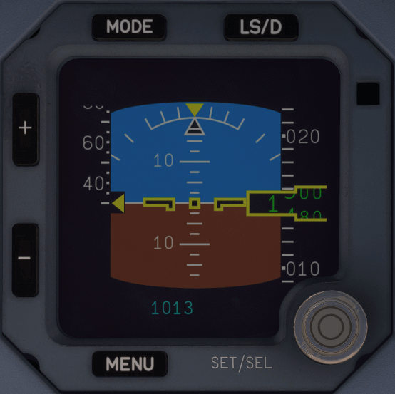

# Integrated Standby Instrument System (ISIS)

---

[Back to Main Instrument Panel and Glareshield](../overviews/main-glare.md){ .md-button }

---

{loading=lazy width=50%}

# Description

In addition to the PFD and ND, the standby instruments provide an independent source of information for:
 
- Air data and inertial reference parameters
- Navigation information.
  
The standby instruments consist of:

- Two Integrated Standby Instruments Systems (ISIS), located at the center of the instrument panel:
    - One ISIS is used as the Standby Flight Display (SFD)
    - The other ISIS is used as the Standby Navigation Display (SND).
- One standby compass.

Each ISIS can be either SFD, or SND. It is not possible to display two SFDs, or two SNDs at the same time. One SFD is 
always displayed.

Both ISIS are connected to fully independent probes:

- One standby pitot probe
- Two standby static probes.

!!! warning ""
    Only one ISIS is available in the A380X at this time.
    Also the ISIS is not fully functional at this time.

## Usage

### LS/DIR TO pb

When pressed, the SFD displays the following LS indications:

- Localizer scale and index
- Glideslope scale and index
- LS course.

### MENU pb

The content of the SFD menu is:

- SET SPD BUG 1 and SET SPD BUG 2 to adjust and display the speed bugs,
- SET ALT BUG to adjust and display an altimeter bug,
- DISPLAY METERS to display aircraft altitude in meter, in addition to the altitude in ft,
- SET BARO UNIT to switch from hPa to inHg,
- DISPLAY NAV to display the aircraft position, heading and track,
- DISPLAY FIX to modify and display a FIX.

### SET/SEL KNOB

- When pressed the displayed item is selected.
- When turned the displayed selection is modified

### Brightness pb

+/- to adjust the brightness of the display.

---

[Back to Main Instrument Panel and Glareshield](../overviews/main-glare.md){ .md-button }

---

