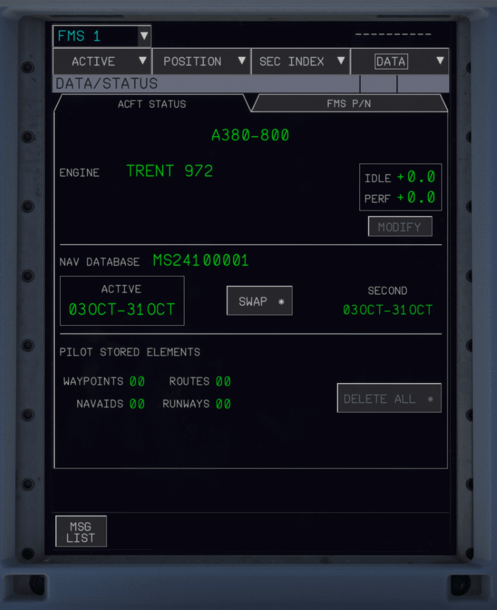

# Multi-Function Display (MFD)

---

[Back to Main Instrument Panel and Glareshield](../overviews/main-glare.md){ .md-button }

---

{laoding=lazy width=50%}

## Description

There are two Multi Function Displays (MFDs). There is one for the Captain and one for the First Officer.

The MFD displays:

- The FMS pages (FMS)
- The ATC Communication pages (ATCCOM)
- The surveillance pages (SURV)
- The FCU backup (FCU BKUP)

The MFD is interactive: The flight crew can navigate through the pages, and can consult, enter or modify the data via 
the KCCU.

!!! tip "MFD Interaction"
    On the A380X users can use their normal mouse and keyboard to interact with the MFD.

!!! note ""
    We will provide a detailed description of the EWD in the future.

---

[Back to Main Instrument Panel and Glareshield](../overviews/main-glare.md){ .md-button }

---

