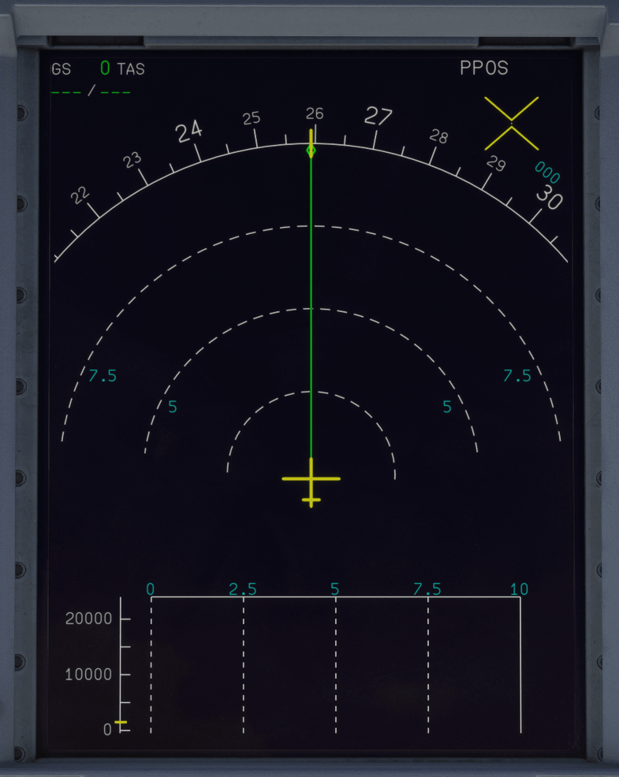

# Navigation Display (ND)

---

[Back to Main Instrument Panel and Glareshield](../overviews/main-glare.md){ .md-button }

---

{loading=lazy width=50%}

## Description

The Navigation Display (ND) provides the flight crew with mid-term information of the status of the
lateral navigation of the aircraft, according to:

- The flight plan
- The navigation database data (waypoints, NAVAIDS, airports).
  
The flight crew can change some items of the flight plan directly from the ND. For more information,

The ND also displays:

- The weather radar, the terrain, or information about traffic collision avoidance
- The airport navigation function. For more information, Refer to Airport Navigation.

For navigation, the flight crew can select one of the following ND modes:

- ARC
- PLAN
- ROSE-NAV
- ROSE-VOR
- ROSE-LS.
 
In PLAN mode, it is not possible to display additional information about the weather radar, the terrain,
or traffic collision avoidance.

The lower part of the ND display unit also provides the Vertical Display (VD) information. 

The Vertical Display (VD) provides the flight crew with an overview of the vertical position of the
aircraft. The VD is a secondary means of navigation, that helps increase the flight crew's awareness of
the aircraft vertical location.

The VD is only available in ARC and ROSE-NAV modes.

When the flight crew sets the EFIS CP RANGE selector to ZOOM, the airport navigation function
appears instead of the vertical display. 

The VD provides the current aircraft position, in relation to the:

- Safety altitudes
- Predicted trajectory
- Weather information
- Terrain information.

The VD is below the Navigation Display (ND).

Note: The VD update occurs after the computations of the FMS, and may last a few seconds longer than the ND update.

!!! note ""
    We will provide a detailed description of the ND in the future.

---

[Back to Main Instrument Panel and Glareshield](../overviews/main-glare.md){ .md-button }

---

