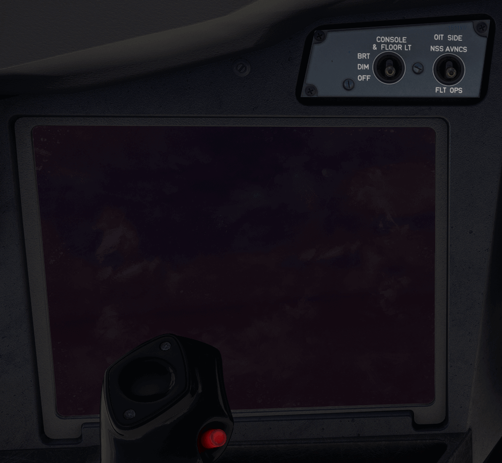

# Onboard Information Terminal (OIT)

---

[Back to Main Instrument Panel and Glareshield](../overviews/main-glare.md){ .md-button }

---

## Description

!!! warning "OIS and OIT"
    THe OIS/OIT is not yet implemented in the A380X. We will provide a detailed description in the future.

---

[Back to Main Instrument Panel and Glareshield](../overviews/main-glare.md){ .md-button }

---