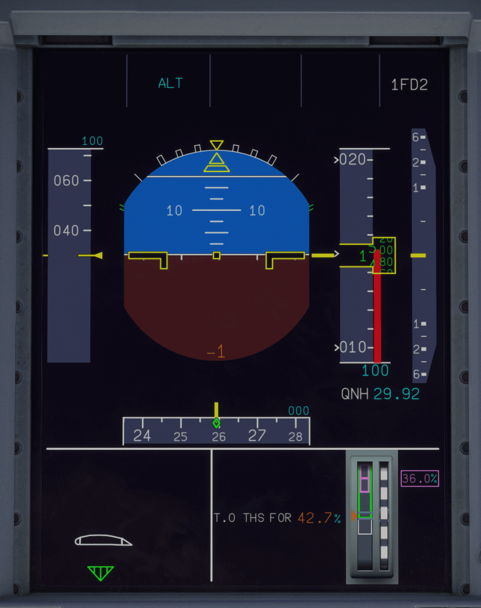

# Primary Flight Display (PFD)

---

[Back to Main Instrument Panel and Glareshield](../overviews/main-glare.md){ .md-button }

---

{loading=lazy width=50%}

## Description

The PFD mainly displays:

- Primary flight parameters (bank angle, pitch angle, speed, Mach, heading, track, altitude, vertical speed, flight 
  path vector, velocity vector)
- Selected and managed guidance targets (e.g. speed and altitude targets)
- Armed and engaged modes, landing capability, AP, FD and A/THR engagement status on the Flight Mode Annunciator (FMA)
- Flight Director guidance orders
- Instrument approach information.

!!! note ""
    We will provide a detailed description of the PFD in the future.

---

[Back to Main Instrument Panel and Glareshield](../overviews/main-glare.md){ .md-button }

---

