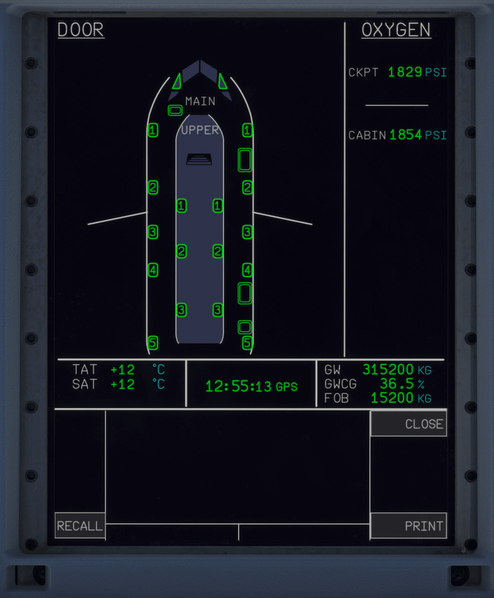

# System Display (SD)

---

[Back to Main Instrument Panel and Glareshield](../overviews/main-glare.md){ .md-button }

---

{loading=lazy width=50%}

## Description

The SD screen has three horizontal sections:

- The top section provides the system display page, the STATUS page, or the STATUS MORE page. In normal operation, the 
  SD provides system display pages. The system display pages appear:
    - Automatically, depending on the flight phase. For more details Refer to Normal Operation, or
    - When manually-selected by the flight crew. For more details refer to [ECP](../pedestal/ecam-cp.md).
- The middle section displays permanently-displayed data such as: External temperature, time,
  aircraft weight, CG, and Fuel On Board (FOB).
- The bottom section displays the mailbox (Refer to ECP).

In addition, after an alert due to a system failure, the SD displays:

- The applicable system display page, if any.
- The aircraft STATUS page after the flight crew clears the alert from the EWD, if the STATUS page
  is not empty.

The System Display (SD) pages appear on the SD in the following decreasing order of priority:

- SD page that the flight crew manually selects.
- SD page that appears after an alert. 
- SD page that automatically appears when there is an advisory. 
- SD page that automatically appears depending on the flight phases. 

Available SD pages are:

- ENG (Engine)
- APU (Auxiliary Power Unit)
- Bleed (Bleed Air
- Cond (Air Conditioning)
- Press (Cabin Pressure)
- Door (Doors, Windows, Slides)
- ElecAc (Electrical AC)
- ElecDc (Electrical DC)
- Fuel (Fuelsystem and Fuel Quantity)
- Wheel (Wheels and Brakes)
- Hyd (Hydraulic)
- Fctl (Flight Controls)
- Cb (Circuit Breakers)
- Crz (Cruise)
- Status (Status)
- Video (Video)

!!! note ""
    We will provide a detailed description of the SD in the future.

---

[Back to Main Instrument Panel and Glareshield](../overviews/main-glare.md){ .md-button }

---

