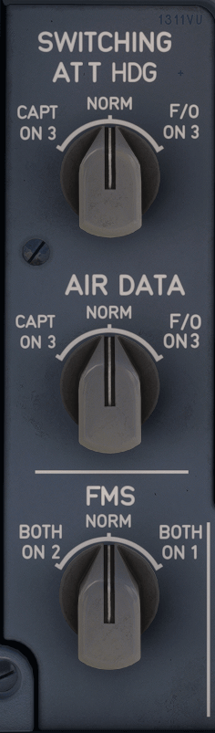

# Switching Panel

---

[Back to Main Instrument Panel and Glareshield](../overviews/main-glare.md){ .md-button }

---

{loading=lazy width=20%}

## Description

## Usage

### ATT HDG SELECTOR

* IR1 supplies data to captain PFD and captain ND.
* IR2 supplies data to first officer PFD and first officer ND.
* IR3 supplies data to captain PFD and captain ND.
* IR3 supplies data to first officer PFD and first officer ND.

### AIR DATA SELECTOR

* ADR1 supplies data to captain PFD and captain ND.
* ADR2 supplies data to first officer PFD and first officer ND.
* ADR3 supplies data to captain PFD and captain ND.
* ADR3 supplies data to first officer PFD and first officer ND.

### FMS SELECTOR

The FMS selector allows the flight crew to link all flight management interfaces on both sides with the
FMC on Captain's side (when selecting BOTH ON 1), or the FMC on First Officer's side (when
selecting BOTH ON 2).

---

[Back to Main Instrument Panel and Glareshield](../overviews/main-glare.md){ .md-button }

---

