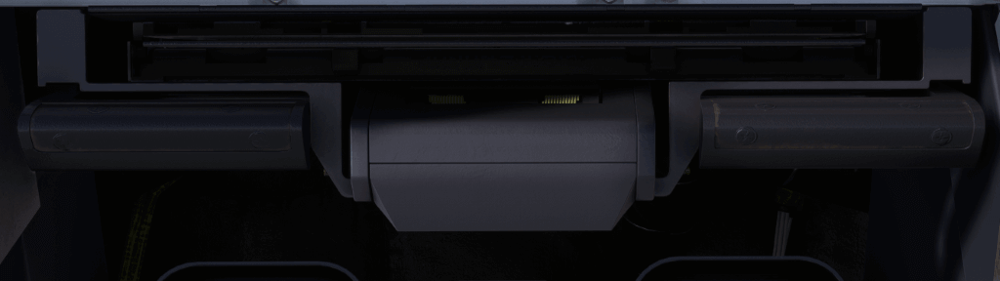
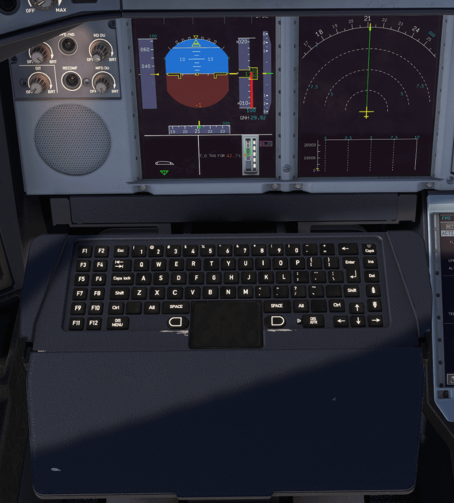

# Table and Keyboard

---

[Back to Main Instrument Panel and Glareshield](../overviews/main-glare.md){ .md-button }

---

{loading=lazy width=50%}
{loading=lazy width=50%}

## Description

Captain and First Officer have a table and keyboard in front of them. The keyboard is used to interact with the OIS 
which is not yet implemented in the A380X.

You can extend the table by clicking the click spot on the stowed table.
You can then also fold back the table cover to access the keyboard.

---

[Back to Main Instrument Panel and Glareshield](../overviews/main-glare.md){ .md-button }

---

