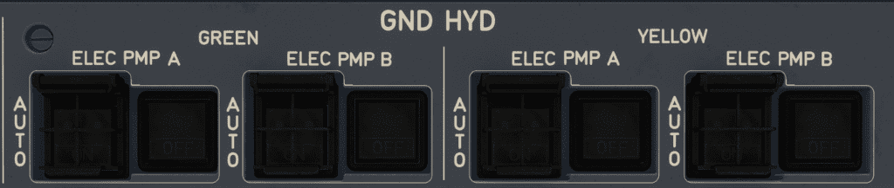

# Hydraulic Panel

---

[Back to Overhead](../overviews/ovhd.md){ .md-button }

---

{loading=lazy}

[//]: # (TODO API Doc Link)

## Description

The aircraft has two identical and independent hydraulic systems, referred to as GREEN 
and YELLOW. These two systems operate continuously, and power the flight controls, the 
landing gear systems, and the cargo doors. Hydraulic fluid cannot be transferred from one system to the other.

In case one or both hydraulic systems fail, the following hydro-electrical backups are available:

- For flight controls: The Electro-Hydrostatic Actuators (EHAs) and the Electrical Backup Hydraulic
  Actuator (EBHA). For information on EHAs and EBHAs: Refer to EHA/EBHA description.
- For braking and nose wheel steering: The Local Electro-Hydraulic Generation System (LEHGS).
  For more information on the LEHGS: Refer to Braking System Architecture and Refer to Nose
  Wheel Steering System.

The normal operating pressure of each hydraulic system is 5 000 PSI.
Each hydraulic system is monitored and controlled by its assigned Hydraulic System Monitoring Unit (HSMU).

The hydraulic systems ensure:

- Hydraulic generation
- Hydraulic distribution.

## Usage HYD Panel

### ENG PMP pb-sw

- AUTO:
    - The pump pressurizes its hydraulic system, when the engine is running.
- OFF:
  The pump is depressurized.
- FAULT:
    - The pump is failed, or the pump must be depressurized because of a hydraulic system failure.
    - Associated with one of the following ECAM alerts:
        - HYD G(Y) ENG 1 or 2 (3 or 4) PMP A or B PRESS LO
        - HYD G(Y) SYS TEMP HI
        - HYD G(Y) SYS OVHT
        - HYD G(Y) RSVR LEVEL LO
        - HYD G(Y) RSVR AIR PRESS LO.
    - The FAULT light goes off, when the flight crew selects OFF. However, in case of an overheat, the FAULT light 
      will remain on, until the overheat disappears.

### ENG PMP A+B DISC pb

- ON
    - Pumps A and B are connected to the engine accessory gearbox.
- DISC
    - Pumps A and B are disconnected from the engine accessory gearbox.
    - Note: When disconnected, they cannot be reconnected by the flight crew. Maintenance action is required. 
- FAULT:
    - The hydraulic system is failed, and cannot be recovered before the end of the flight. 
    - Therefore, the pumps must be disconnected from the engine accessory gearbox.
    - Associated with one of the following ECAM alerts:
        - HYD G(Y) RSVR LEVEL LO
        - HYD G(Y) SYS TEMP HI (If pump depressurization failed)
        - HYD G(Y) SYS OVHT.
    - The FAULT light goes off, when the crew selects DISC.

## Usage GND HYD Panel

### ELEC PMP ON pb
- OFF:
    - The electric pump is not running.
- ON:
  The electric pump is running.
    - Electric pumps may run:
        - In automatic mode, or
        - In manual mode, by pressing the ELEC PMP ON pb (for maintenance purpose only).
    - Note:
        - When the electric pump is already running in automatic mode, action on the ELEC PMP ON pb has no effect.
        - When the electric pump is already running in manual mode, the automatic mode is disregarded (e.g. cargo door 
          actuation).

!!! warning ""
    When an electric pump is running in manual mode, the corresponding hydraulic system is fully pressurized.
    Do not select manually any electric pump without clearance from the ground crew.ELEC PMP ON pb

## ELEC PMP pb-sw
The electric pumps are fully automatic and do not require any crew action, unless requested by the ECAM.

- AUTO:
    - The HSMU automatically controls the pump.
- OFF:
    - The pump is OFF and can neither be started by the HSMU, nor by the flight crew.
- FAULT:
    - The pump is failed, or the pump must be stopped because of a hydraulic system failure.
    - Associated with one of the following ECAM alerts:
        - HYD G(Y) ELEC PMP A (B) FAULT
        - HYD G(Y) SYS TEMP HI (on ground, with engines OFF)
        - HYD G(Y) SYS OVHT (on ground, with engines OFF)
        - HYD G(Y) RSVR LEVEL LO (on ground, with engines OFF)
        - HYD G(Y) RSVR AIR PRESS LO (on ground, with engines OFF) (Refer to procedure).
    - The FAULT light goes off, when the flight crew selects OFF. However, in case of an overheat, the FAULT light will
      remain on, until the overheat disappears.

---

[Back to Overhead](../overviews/ovhd.md){ .md-button }

---

