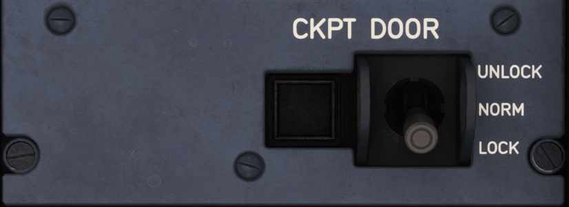

# Cockpit Door Panel

---

[Back to Pedestal](../overviews/pedestal.md){ .md-button }

---

{loading=lazy width=50%}

## Description

The cockpit door automatically locks, as soon as it closes, when the Cockpit Door Locking System
(CDLS) is powered.

A Cockpit Door Lock Control Unit (CDLCU) electrically locks and unlocks the cockpit door.
If the CDLS fails, the door unlocks but remains closed. The flight crew can lock the door by using the
dead bolt.

The flight crew uses the CKPT DOOR sw to either open the cockpit door, or to refuse access to the
cockpit. 

At any time, the flight crew can use the door handle to manually open the cockpit door.

## Usage

- UNLOCK
    - Unlocks the door, as long as the flight crew maintains the UNLOCK position.
    - Note: When the flight crew releases the switch, it goes back to the NORM position.
- NORM:
    - The door is locked. If a crewmember enters a routine access code on the keypad, the door remains locked. 
    - Note: If a crewmember enters the emergency access code on the keypad, the door automatically unlocks for 5 s, 
      after a defined period of time. 
    - The Operator defines this period of time.
- LOCK:
    - Locks the door, and inhibits the keypad and the buzzer for a defined period of time.
    - The Operator defines this period of time (between 5 min and 20 min).
    - Note: When the flight crew releases the switch, it goes back to the NORM position.

---

[Back to Pedestal](../overviews/pedestal.md){ .md-button }

---

