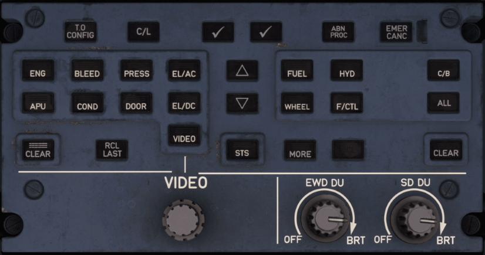

# ECAM Control Panel (ECP) 

---

[Back to Pedestal](../overviews/pedestal.md){ .md-button }

---

## Description

The flight crew uses the ECAM Control Panel (ECP) to interface with the ECAM system. There is one
ECP, and it is located on the central pedestal.

The ECP provides keys that enables the flight crew to:

- Navigate in a menu list, checklist, and/or procedure
- Select an item in a menu list
- Activate an item in a checklist and/or procedure
- Activate the takeoff configuration test
- Clear or cancel alerts
- Access some system pages
- Access normal checklists
- Access not-sensed ABN PROC
- Access STATUS page
- Access STATUS MORE page
- Access additional information system pages.
  In addition, the ECP provides:
- Rotary selectors to turn the EWD and SD on and off, and to adjust their brightness
- Video display selection and control.

!!! note ""
    We will provide a detailed description of the SD in the future.

## Usage

### T.O CONFIG

Simulates the application of takeoff power, by initiating a takeoff configuration
test. A warning triggers, if any monitored system is not in the correct takeoff
configuration. 

If the test is successful, the EWD displays a T.O CONFIG NORMAL message in
the takeoff memo section.

### C/L

The EWD displays the normal checklist menu.

### &check;

When pressed, validates/devalidates the item that is surrounded by a blue box
on the EWD.

- Validates/devalidates a checklist item or procedure item, that is not detected
  by the ECAM.
- Selects one item of a checklist menu or procedure menu.

### UP-ARROW

The blue box moves up to the previous selectable item on the EWD screen.

If pressed and held, the blue box moves up to the previous selectable item on the
EWD screen, until released. The blue box cannot surround a grey line (except on
the checklist menu).

### DOWN-ARROW

The blue box moves down to the next selectable item on the EWD screen.If
pressed and held, the blue box moves down to the next selectable item on the
EWD screen, until released.

The blue box cannot surround a grey line (except on the checklist menu).

### ABN PROC (INOP)

The EWD displays the menu of not—sensed emergency or abnormal
procedures. The ECAM cannot detect these procedures. Therefore, the flight
crew manually requests their display, when necessary.

### EMER CANC (INOP)

The EMER CANC pb is a guarded pushbutton.

- Cancels the audio indicator and turns off the MASTER WARN light
  associated with an ECAM warning. 
  However, the associated procedure remains displayed on the EWD. 
  The audio indicator and MASTER WARN light are not canceled for the
  remainder of the flight. If the ECAM warning is triggered a second time, the
  audio indicator and MASTER WARN light appear again
- Cancels the SC, the procedure on the EWD, and turns off the MASTER CAUT light, associated with an ECAM caution. 
  The ECAM caution is canceled for the remainder of the flight, even if the triggering conditions occur again
- Cancels all the audio indicators and aural alerts. If the triggering conditions occur again, the audio indicators and
  the aural alerts sound again
- Deactivates any activated not-sensed procedure.
- Note: 
    - All the alerts that are still active and canceled via the EMER CANC pb appear again on the EWD when the flight 
      crew presses the RCL pb on the ECP for more than three seconds.
    - When pressed and if there is no alert that the flight crew can cancel, the EWD displays the EMERGENCY CANCEL ON 
      message.

### System Pages Buttons

- ENG (Engine)
- APU (Auxiliary Power Unit)
- Bleed (Bleed Air
- Cond (Air Conditioning)
- Press (Cabin Pressure)
- Door (Doors, Windows, Slides)
- ElecAc (Electrical AC)
- ElecDc (Electrical DC)
- Fuel (Fuelsystem and Fuel Quantity)
- Wheel (Wheels and Brakes)
- Hyd (Hydraulic)
- Fctl (Flight Controls)
- C/B (Circuit Breakers)
- Crz (Cruise)
- Status (Status)
- Video (Video)

### ALL

When pressed and maintained, each system display page consecutively appears
on the SD, for three seconds.

When released, the last system display page remains, until a new display is either
requested by the flight crew, or prompted by the ECAM.

### CLEAR

* On EWD or SD clears the lines indicated by the displayed vertical bar.
* The CLEAR pb light comes on, when there is an alert to clear on EWD.
* Note: The CLEAR pb does not cancel any aural alerts associated witha caution/warning, and does not deactivate a 
  Not-Sensed ABN PROC.

### RCL LAST

Cancels the last CLEAR pb action on an alert.

### STS 

- The SD displays the STATUS page, if applicable.
- The SD displays NORMAL, if the STATUS page is empty.
- If the SD displays a STATUS page, the STS pb comes on.
- If pressed again, when the SD displays the STATUS page, the page is cleared.

### MORE

The SD displays the MORE information page that is available when MORE
appears on the system display pages and STATUS page.

When the SD already displays the MORE information page, pressing again this
pushbutton clears the MORE information page.

### VIDEO knob (INOP))

Displays the selected video on the applicable display unit.

### EWD DU knob

Turns the EWD on/off and adjusts its brightness.

### SD DU knob

Turns the SD on/off and adjusts its brightness.

---

[Back to Pedestal](../overviews/pedestal.md){ .md-button }

---

