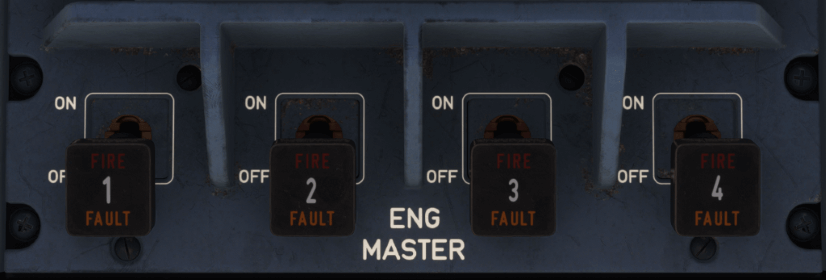

# Thrust and Thrust Reverser Control Levers

---

[Back to Pedestal](../overviews/pedestal.md){ .md-button }

---

## Usage

### ENGINE 1(2)(3)(4) MASTER LEVER

- When put to ON: 
    - The FADEC initiates an automatic engine start sequence, provided the ENG START selector is set to IGN START position, 
      or for more information, Refer to DSC-70-30 Automatic start sequence.
    - Turns on the igniters and the fuel, if the ENG MAN START pb-sw is set to ON.

- When put to OFF:
    - Shutdowns the engine or aborts the start sequence. The FADEC resets.

### ENGINE MASTER 1(2)(3)(4) LIGHT

- FIRE (red):
    - A fire is detected on the corresponding engine.
    - Associated with the following ECAM alerts:
        - ENG 1(2)(3)(4) FIRE (IN FLIGHT).
        - ENG 1(2)(3)(4) FIRE (ON GROUND).

- FAULT (amber):
    - An automatic start sequence aborts, or
    - The HP fuel valve position is abnormal.
    - Associated with the ECAM alert ENG 1(2)(3)(4) HP FUEL VLV FAULT 
    - The overthrust protection is active and the FADEC automatically shut downs the engine.
    - Associated with the ECAM alert ENG 1(2)(3)(4) CTL SYS FAULT

---

[Back to Pedestal](../overviews/pedestal.md){ .md-button }

---

