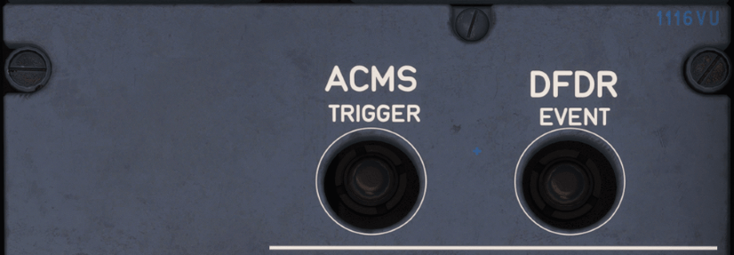

# Flight Data Recording System (FDRS)

---

[Back to Pedestal](../overviews/pedestal.md){ .md-button }

---

{loading=lazy width=100%}

## Aircraft Conditioning Monitoring System (ACMS)

The ACMS function provides a real-time monitoring of the aircraft parameters.

The ACMS can generate system reports, that can be:

- Printed: Automatically or via the ACMS TRIGGER pb on the pedestal (Refer to ACMS TRIGGER pb), and/or
- Sent via ACARS or Gatelink, and/or
- Stored on the Network Server System (NSS).

Default ACMS reports and triggering conditions are available at aircraft delivery. The Operator can customize the 
content and the triggering conditions of the reports.

### ACMS TRIGGER PB

When pressed, prints a specific ACMS report and/or triggers the recording of some specific parameters.
The Operator can customize the content and the triggering conditions of the ACMS reports.

## Digital Flight Data Recorder (DFDR)

The DFDR records flight parameters and data from various aircraft systems.

The DFDR stores the data in a memory, that keeps all the recorded data for at least the last 25 h of operation. 
The recorder data remains protected, in the event of high G-loads, fire, water, or other damage. An underwater locator 
beacon is attached to the DFDR.

### DFDR Location

The flight crew uses the DFDR EVENT pb to point an event in the recorded data.

### DFDR EVENT PB

When pressed, it points an event in the recorded DFDR data.

---

[Back to Pedestal](../overviews/pedestal.md){ .md-button }

---

