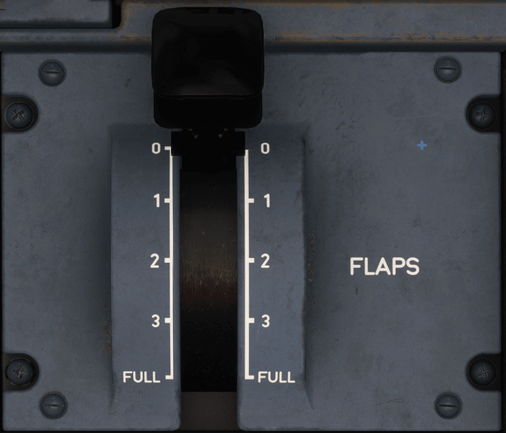

# Flaps Lever Panel

---

[Back to Pedestal](../overviews/pedestal.md){ .md-button }

---

{loading=lazy width=50%}

## Description

The FLAPS lever controls the operation of the slats and flaps.

The five lever positions correspond to the following surface positions :

| Position | ECAM  | Max Speed  | Phase                 |
|:--------:|:-----:|:----------:|:----------------------|
|    0     |       |            | CRUISE                |
|    1     | 1/1+F | 263/222 kt | HOLD / TAKE OFF       |
|    2     |   2   |   220 kt   | TAKE OFF / APPR       |
|    3     |   3   |   196 kt   | TAKE OFF / LDG / APPR |
|   FULL   | FULL  |   182 kt   | LDG                   |

Before selecting any position, the pilot must pull the lever out of the detent. Stops at positions 1 and 3 prevent the 
pilot from calling for excessive flap/slat travel with a single action.

Note: The pilot cannot select an intermediate lever position.

---

[Back to Pedestal](../overviews/pedestal.md){ .md-button }

---

