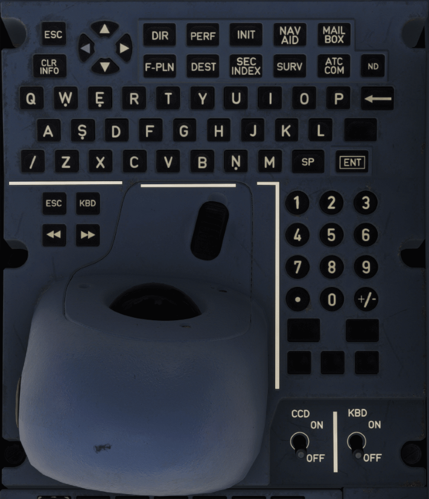

# Keyboard Cursor Control Unit (KCCU)

---

[Back to Pedestal](../overviews/pedestal.md){ .md-button }

---

{loading=lazy width=70%}

## Description

There are two Keyboard and Cursor Control Units (KCCUs) on the center pedestal. There is one for
the Captain and one for the First Officer.

The flight crew uses the KCCU to:

- Navigate through the FMS pages on the MFD
- Enter and modify data on the MFD FMS pages
- Perform some flight plan revisions on the ND.

The FMS dedicated KCCU controls are:

- The FMS shortcut keys
- The CLR INFO key
- The ND key
- The Navigation keys

### FMS Shortcut Keys

The FMS shortcut keys are used to access the FMS pages directly. The keys are labeled with the
corresponding FMS page name.

### DIR KEY
When pressed:

- Displays the DIRECT TO page on the MFD (Refer to Page)
- Moves the cursor back to the MFD, if it was previously on another display.

### PERF KEY
When pressed:

- Displays the ACTIVE/PERF page (on the panel that corresponds to the active flight phase) on the MFD (Refer to Page)
- Moves the cursor back to the MFD, if it was previously on another display.

### INIT KEY
When pressed:

- Displays the ACTIVE/INIT page on the MFD (Refer to Page)
- Moves the cursor back to the MFD, if it was previously on another display.

### NAVAID KEY
When pressed:

- Displays the POSITION/NAVAIDS page on the MFD (Refer to Page)
- Moves the cursor back to the MFD, if it was previously on another display.

### F-PLN KEY
When pressed:

- Displays the top of the flight plan on the ACTIVE/F-PLN page on the MFD (Refer to Page)
- Moves the cursor back to the MFD, if it was previously on another display.

### DEST KEY
When pressed:

- Displays the bottom of the primary flight plan on the ACTIVE/F-PLN page on the MFD (Refer to Page)
- Moves the cursor back to the MFD, if it was previously on another display.

### SEC INDEX KEY
When pressed:

- Displays the FMS SEC INDEX page on the MFD (Refer to Page)
- Moves the cursor back to the MFD, if it was previously on another display.

### CLR INFO KEY
When pressed, clears the message that is currently displayed in the FMS Message Area.

!!! info ""
    Note: The CLR INFO key is also used to clear the ATCCOM, and SURV messages.

### ND KEY (INOP)
When pressed, moves the cursor to the ND.

### Navigation Keys
Moves the cursor to the display unit that is to the right, or to the left, of the one that is currently selected 
(if applicable).

### CCD sw

- ON:
    - The KCCU cursor control device (trackball) is active.
- OFF:
    - The KCCU cursor control device is inactive.

### KBD sw

- ON:
    - The KCCU keyboard is active.
- OFF:
    - The KCCU keyboard is inactive.

---

[Back to Pedestal](../overviews/pedestal.md){ .md-button }

---

