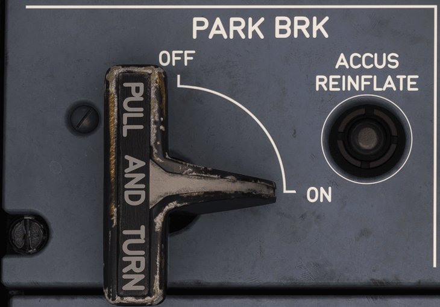

# Parking Brake Panel

[Back to Pedestal](../overviews/pedestal.md){ .md-button }

---

## Overview

## Parking Brake Handle

To apply the Parking Brake, the flight crew pulls this handle and turns it clockwise.

The message "PARK BRK" appears on the ECAM.

To release the Parking Brake, the handle is turned counterclockwise.

## Accus Reinflate

If the parking brake hydraulic pressure is low and all the engines are shut down, the ACCUS
REINFLATE pb can be used to activate the BLG LEHGS (Body L/G Local Electro-Hydraulic Generation Systems) and reinflate 
the BLG accumulators. 

With initial nominal BLG ACCUS filling, the parking brake is efficient for 12 h.

---

[Back to Pedestal](../overviews/pedestal.md){ .md-button }

