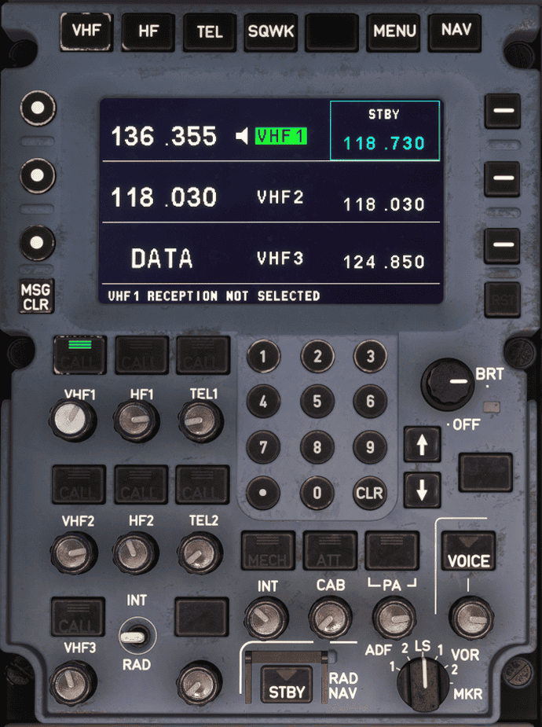
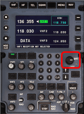
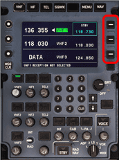
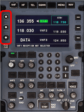
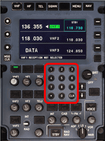
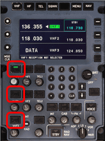
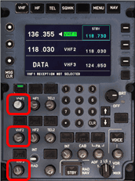
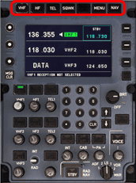
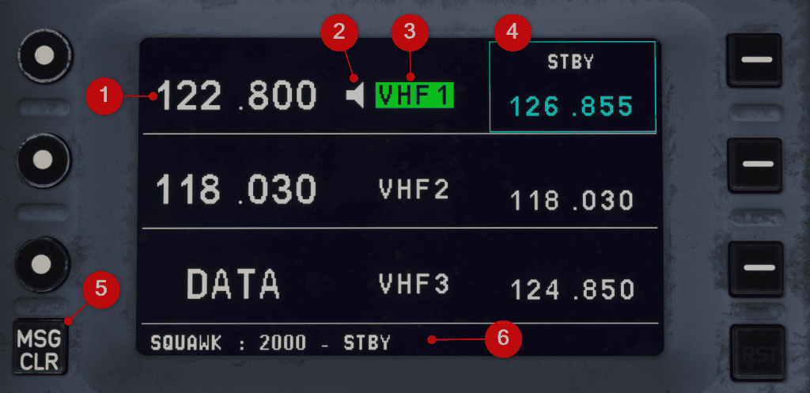

# Radio Management Panel (RMP)

---

[Back to Pedestal](../overviews/pedestal.md){ .md-button }

---

{loading=lazy width=70%}

## Description

The Radio Management Panels (RMP) are powerful systems managing the aircraft's communication and std-by navigation 
systems.

We are planning a separate more in-depth guide for the RMPs, but here is a brief overview:

There are three Radio Management Panels (RMPs) in the cockpit. The flight crew uses these RMPs to control the
communication system.

On each RMP, the flight crew can:

- Select the communication mean(s) in transmission and/or reception mode(s)
- Tune HF and VHF frequencies
- Dial SATCOM Telephone (TEL) numbers
- Select voice or data mode
- Monitor and change data mode parameters
- Enter the Squawk (SQWK) code
- Select Standby Radio Navigation (STBY RAD NAV) and tune the NAVAIDs (only via RMP 1 and RMP 2).
- Adjust the volume for voice communication and for NAVAID identification.

The RMPs share selections and inputs to enable the flight crew to control all radio communication via any RMP.

The RMPs share mainly the following data:

- Active and standby frequencies
- SATCOM channels and their status (e.g. logged on/off, connected)
- Active function displays (e.g. Amplitude Modulation (AM))
  However, it is possible to display a different page on each RMP.

In normal operation:

- The Captain controls communication via RMP 1
- The First Officer controls communication via RMP 2
- The third and the fourth occupants control communication via RMP 3.
- RMPs 1 and 2 are directly connected to the VHF and HF transceivers.
- RMP 1 transmits all commands to VHF 1, VHF 3 and HF 1.
- RMP 2 transmits all commands to VHF 2 and HF 2.
- RMP 3 transmits commands to RMP 1 or RMP 2, via the appropriate control connection.
- RMP 1 and/or RMP 2 then send these commands to the appropriate transceivers.
- All three RMPs are directly connected to the SATCOM system.

## Usage

!!! warning "RMP in the A380X"
    The RMPs are not yet fully implemented in the A380X.

    They can be used for the pilot <-> ATC communication with VHF and squawk code entry. 
    Currently no other features are available.

    The RMPs are planned to be fully implemented in the future.

    Below we will only describe the features that are currently available in the A380X.

!!! warning "VATSIM vPilot"
    Unfortunately, the VATSIM vPilot plugin does not support a correct usage of the RMPs yet.

    Current known limitations when using vPilot:

    - vPilot doest not support 3 RMPs, only 2.
    - vPilot does not support the volume contol of the RMP's reception knobs.
    - VHF1/COM1 works well, but VHF2/COM2 only works if you turn VHF3/COM3 receive on.

### BRT/OFF KNOB

!!! block ""
    {loading=lazy align=right}

    The flight crew uses the BRT/OFF knob to turn the RMP on or off, and to adjust the brightness of the
    RMP screen.

    The status indicator changes color to indicate the status of the RMP:

    - Green: The RMP is off and in standby mode.
    - Red:
        - if the knob is pointing to OFF then the RMP is off and failed.
        - if the knob is not pointing to OFF then the RMP is on and failed.
    - no light: The RMP is on.

### LINE SELECTION KEYS (LSK 1-3)

!!! block ""
    {loading=lazy align=right}

    When pressed, select, validate, or activate the corresponding displays (e.g.
    frequencies, functions, page titles).

### ACTIVATION/DIALING KEYS (ADK 1-3)

!!! block ""
    {loading=lazy align=right}

    When pressed, dial, select, validate, activate the corresponding displays (e.g.
    frequencies, functions).

### NUMERIC KEYS

!!! block ""
    {loading=lazy align=right}

    When pressed, enter numeric values (e.g. frequencies, squawk codes).
    
    CLR KEY:

    - When pressed, clears the last digit entered.
    - When pressed and held, clears all digits entered.

### VHF TRANSMISSION KEYS (VHF 1(2)(3))

!!! block ""
    {loading=lazy align=right}

    - Not illuminated:
        - The associated communication mean (i.e. VHF 1(2)(3)) is not in transmission mode.
        - When pressed, the transmission key turns on the transmission mode.
        - Note: Only one communication mean at a time (internal and external communication) can be in transmission mode 
          on each RMP.
    - Illuminated green:
        - The associated communication mean (i.e. VHF 1(2)(3)) is in transmission mode. 
        - When pressed, the transmission key turns off the transmission mode.
    
### VHF RECEPTION KNOBS (VHF 1(2)(3))

!!! block ""
    {loading=lazy align=right}
    
    - Dark and in:
        - The associated communication mean (i.e. VHF 1(2)(3)) is in reception mode.
        - When pressed and released in the out position, the reception knob turns off the reception mode.
    - Illuminated and out:
        - The associated communication mean (i.e. VHF 1(2)(3)) is in reception mode.
        - When pressed and released in the in position, the reception knob turns off the reception mode.
        - When turned, the reception knob adjusts the volume of the headset.

### RMP Page Access Keys

!!! block ""
    {loading=lazy align=right}

    - The RMPs have multiple pages that can be selected by pressing the LSK 1-3 keys.

### VHF Page

{loading=lazy}

1. Active frequency
2. Loadspeaker symbol (indicating if reception is on or not)
3. Transceiver Indicator (indicating if transmission is on or not)
4. Standby frequency
5. Clear the RMP message line
6. RMP message line

### Squawk Page

The Squawk page is used to quickly enter a squawk code.

The transponder system (XPDR) is otherwise managed in the [MFD](../main-panel/mfd.md) and not on the RMP. 

---

[Back to Pedestal](../overviews/pedestal.md){ .md-button }

---

