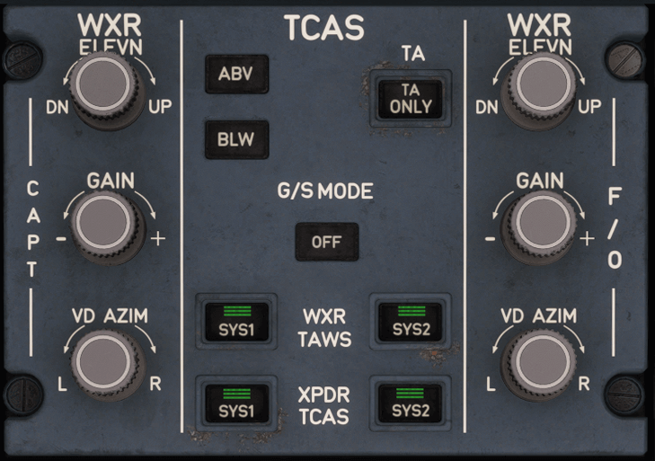

# Surveillance Panel

---

[Back to Pedestal](../overviews/pedestal.md){ .md-button }

---

{loading=lazy width=70%}

## Description

The Surveillance (SURV) system includes the following systems that perform aircraft surveillance
functions:

- Terrain Awareness and Warning System (TAWS)
- Weather Radar (WXR) system, including the predictive windshear detection
- Traffic Collision Avoidance System (TCAS)
- Transponder (XPDR).

!!! warning ""
    The Surveillance Panel is not yet fully implemented in the A380X.

    You can use the 
    [MFD's SURV](../../../a380x-beginner-guide/02_cockpit-preparation.md#mfd-surveillance-default-settings) page to 
    setup surveillance systems.

## Usage

### WXR Controls (INOP)

!!! warning "WXR in the A380X"
    The Weather Radar (WXR) is inoperative in the A380X.

### TA pb

- Not illuminated:
    - The TCAS is in TA/RA mode.
- TA ONLY illuminated:
    - The TCAS is in TA ONLY mode.
    - Associated with the TA ONLY message on the ND.

### ABV and BLW pb

- Not illuminated:
    - The TCAS display is in NORM mode.
- ABV illuminated:
    - The TCAS display is in ABV mode.
- BLW illuminated:
    - The TCAS display is in BLW mode.

### G/S MODE pb

- AUTO:
    - The G/S mode (mode 5) is active.
    - This is the default position.
    - On the SURV/CONTROLS page of the MFD, the G/S MODE button is automatically set to ON.
- OFF:
    - The flight crew turns off the G/S mode (mode 5).
    - Associated with the TAWS G/S MODE OFF MEMO.
    - On the SURV/CONTROLS page of the MFD, the G/S MODE button is automatically set to OFF.

### WXR/TAWS SYS 1(2) pb
SYS 1 or 2 provides the WXR/TAWS functions.

Note: On the SURV/STATUS & SWITCHING page of the MFD, the WXR/TAWS SYS 1(2) buttons are automatically updated.

### XPDR/TCAS SYS 1(2) pb
SYS 1 provides the XPDR/TCAS functions.

Note: On the SURV/STATUS & SWITCHING page of the MFD, the XPDR/TCAS SYS 1(2) buttons are automatically updated.

---

[Back to Pedestal](../overviews/pedestal.md){ .md-button }

---

