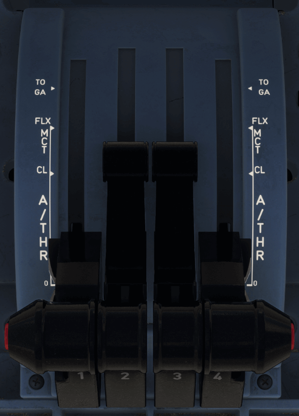

# Thrust and Thrust Reverser Control Levers

---

[Back to Pedestal](../overviews/pedestal.md){ .md-button }

---

{width=50%}

[//]: # (TODO: This needs polishing)

## Description

The A380 has so called FADECs which stands for Full Authority Digital Engine Control and is responsible to ensure the 
engine to perform at maximum efficiency for the given condition.

As one FADEC dedicated to each engine controls the engines' operation, the pilots or the FMGS can set the thrust. The 
pilot uses the thrust levers when in manual mode and the FMGS sets the thrust in automatic mode (A/THR aka Autothrust).

The thrust levers in the A380 can only be moved manually and are not moved by an autothrottle system as it does in 
Boeing aircraft.

The FADEC controls and limits thrust not to exceed the limit set via the thrust lever position in both manual and 
automatic modes.

The FADEC receives the current thrust lever position and computes the thrust rating limit and the N1 for that Thrust 
Lever Angle (TLA).

If the thrust lever is between two detents, the FADEC will select the rating limit of the higher detent.

### Thrust Levers

The thrust levers are used to manually adjust the engine thrust.

Each thrust lever can be moved individually.

The thrust lever position appears on the EWD via a blue circle on the thrust gauge.

### Thrust Detents 

The flight crew can set each thrust lever in one of the following detents:

- Idle (0) detent
- Climb (CLB) detent
- Flexible takeoff thrust (FLX) and Maximum Continuous Thrust (MCT) detent
- Takeoff and Go-Around (TOGA) detent.
 
Each detent has one or several thrust rating limits.

### Thrust Reverser 2(3) Lever

The thrust reversers levers are used to control the deployment and the stowing of the reversers, and to
adjust the reverse thrust.

Each thrust reverser lever can be moved individually from IDLE REV detent to MAX REV detent, when
the associated thrust lever is in the IDLE detent.

The flight crew can monitor the position of the thrust reverser lever on the EWD, via the blue circle on
the reverse thrust gauge.

### Automatic Thrust Control

In autothrust mode (A/THR function active), the FMGC computes the thrust. Thrust is limited by the thrust lever position 
(except when in alpha-floor mode).

#### A/THR Instinctive Disconnect Push Button

Each thrust lever has a so-called "A/THR Instinctive Disconnect" push button in red. Pressing it disconnects the A/THR.

!!! warning ""
    If the flight crew pushes and holds one instinctive disconnect pb for more than 15 s, the A/THR system 
    is disconnected for the remainder of the flight. All A/THR functions including ALPHA FLOOR are lost, and they can be 
    recovered only at the next FMGC power-up (on ground).

### Manual Thrust Control

When the auto-thrust (A/THR) mode is not armed or not active (levers in wrong position) the engines are in manual mode.

The thrust lever position controls thrust for the corresponding engine in this case.

By moving the thrust lever, the pilot can set the thrust level, which corresponds to a N1 between the IDLE and TOGA
positions.

FLX/MCT detent:

- On the ground, the engine will produce the Maximum Continuous Thrust (MCT) if the crew did not set a valid FLEX take
  off temperature. It needs to be higher than the current Total Air Temperature (TAT) to have any effect.
- After takeoff with FLEX thrust, the pilot can, by moving the thrust lever to TOGA or CL, chose MCT thrust. It is not
  possible to go back to FLEX thrust.

!!! info ""
    Note: Setting the thrust lever out of FLX/MCT detent without reaching TOGA or CL detent has no effect.

MAX TO thrust can always be achieved by pushing the thrust lever all the way forward.

!!! warning "FLEX TO thrust is not yet available on the A380."

---

[Back to Pedestal](../overviews/pedestal.md){ .md-button }

---

