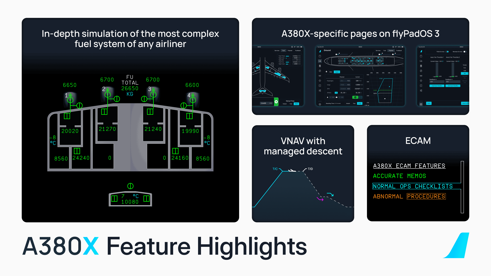
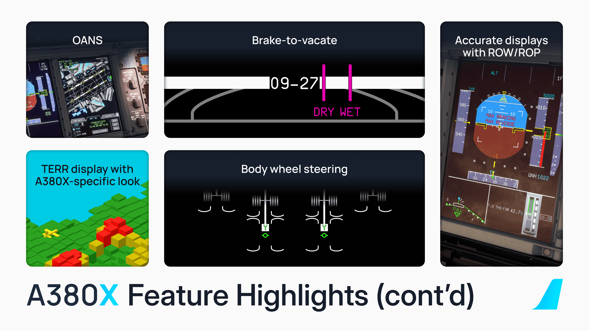

[//]: # (<link rel="stylesheet" href="../../stylesheets/toc-tables.css">)

# A380X Alpha Release v0.12.1

This update primarily addresses some issues that were present in our v0.12 release. 

Happy Flying!

For a full release changelog - [see below](#changelog)

## Previous Feature Releases

[See Previous Release - v0.12.0](v0120.md){.md-button}

{width=45% loading=lazy align=left}
{width=45% loading=lazy align=right}

## Changelog

1. [GENERAL] Fixed issue in C++ WASM Framework that caused performance degradation in some WASM modules - @frankkopp (Frank Kopp)
1. [A380X/FCU] Fix baro-preselect not recognising baro unit changes - @tracernz (Mike)
1. [A380X/EFB] Fixed doors automatically opening in flight - @saschl (saschl)
1. [A380X/FMS] Fixed layouting issue on FMS/ACTIVE/PERF/T.O page for some users - @flogross89 (floridude)
1. [A380X/TELEX] Added popup for telex consent @saschl (saschl) @Maximilian-Reuter (\_chaoz)